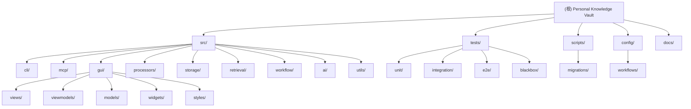

# Personal Knowledge Vault - 项目索引

> **AI-First Knowledge Workflow System**
> 工作流驱动的个人知识管理系统

**最后更新**: 2026-02-23 10:45:33

---

## 变更记录 (Changelog)

### 2026-02-23 10:45
- M12 完成：AI 对话完整实现 -- 流式输出 + 知识引用 + URL 归档 + 会话管理
- 新增 `src/gui/` 模块扩展：ChatView、ChatViewModel、AutocompletePopup、knowledge_ref、theme_colors
- 新增 `scripts/migrations/004_add_chat_sessions.sql` 数据库迁移
- 新增 `scripts/setup-test-db.py` 测试数据生成脚本
- 新增 MCP E2E 测试体系：conftest.py + 3 个 E2E 测试文件
- 新增 M12 手动测试目录 `tests/manual_test_m12/` (6 个脚本)
- 新增 GUI 单元测试：test_chat_viewmodel.py, test_knowledge_ref.py, test_autocomplete_popup.py
- 新增 GUI 模块 AGENTS.md 文档
- 版本号升级至 v0.8.0-alpha

### 2026-02-19 00:58
- M8 + M9 完成：MCP 服务层（只读 + 写入 + Prompt + 安全加固）
- 新增 `src/mcp/` 模块（server.py, tools.py, resources.py, prompts.py, utils.py, __main__.py）
- 新增三层 MCP 测试体系：单元 4 文件 + 集成 2 文件 + 黑盒 1 文件（共 203 tests）
- 新增 `config/workflows/archive-text.yaml` 工作流配置
- `src/storage/vector_store.py` 新增 `get_doc_vector()` 方法
- 版本号升级至 v0.7.0

### 2026-02-16 18:51
- 基于 v0.6.1 和 M6+M7 完成情况全面更新索引体系
- 新增 CLI 模块、Scripts 运维脚本、数据库迁移管理器的完整文档
- 更新模块结构图,体现 AI 安全测试和数据库迁移系统
- 补充测试覆盖率统计和最新的项目规模数据

### 2026-02-16 01:53
- 生成完整的 AGENTS.md 索引文档体系
- 添加模块结构图和导航面包屑
- 为每个核心模块生成独立的 AGENTS.md 文档

---

## 项目愿景

构建一个以 **AI 协作**为核心的个人知识管理系统,通过**工作流编排**实现灵活的内容归档与智能检索:

- **AI-First**: 以 Codex/CodeX 作为智能协作伙伴,支持人机协作的知识处理
- **工作流驱动**: 一切操作皆工作流,可编排、可观测、可中断
- **智能检索**: 根据内容特点自动选择 BM25/向量/混合检索策略
- **本地优先**: 数据完全掌控,Markdown 主存储,SQLite+hnswlib 辅助索引
- **成本可控**: 智能策略节省 85% API 成本
- **安全可靠**: 测试环境隔离、自动备份、数据库增量迁移
- **MCP 开放**: 通过 MCP 协议将知识库暴露给任意 AI Agent
- **桌面 GUI**: PySide6 桌面应用,AI 对话与知识浏览一体化

---

## 架构总览

### 核心设计理念

**工作流驱动 + 插件化处理 + 灵活深度 + AI 安全协作 + MCP 开放集成 + GUI 桌面应用**

系统采用工作流引擎编排各模块,每种内容类型对应独立的处理 Pipeline,深度由内容复杂度决定而非架构强制。通过测试环境隔离和数据库版本管理确保生产数据安全。MCP 服务层使 AI Agent 可直接搜索、归档和管理知识库。GUI 桌面应用提供完整的知识浏览、搜索、归档和 AI 对话功能。

### 技术栈

- **语言**: Python 3.11+ (推荐 Conda 环境)
- **GUI 框架**: PySide6 (Qt6) + qasync (asyncio 集成)
- **CLI 框架**: Click 8.0+ (Rich 终端界面)
- **MCP 框架**: FastMCP (mcp SDK) -- stdio / streamable-http 双传输
- **存储**: Markdown (YAML Front Matter) + SQLite (FTS5) + hnswlib (向量索引)
- **AI 服务**: DeepSeek (摘要/标签/对话) + OpenAI (Embedding)
- **检索**: BM25 + 向量检索 + 混合策略 (RRF 算法)
- **分词**: jieba (中文分词)
- **渲染**: markdown2 + Pygments (Markdown/代码高亮)
- **安全**: SSRF 防护 + 文本长度验证 + Bearer Token 认证

### 架构分层

```
┌─────────────────────────────────────────┐
│  GUI 桌面应用层 (src/gui/)    [M10-M12] │
│  + PySide6 (Qt6) 桌面界面               │
│  + MVVM: View / ViewModel / Model       │
│  + AI 对话: 流式输出 + 知识引用          │
│  + qasync: asyncio + Qt 事件循环集成    │
├─────────────────────────────────────────┤
│  CLI 交互层 (src/cli/)                   │
│  + Click 命令组 (archive/search/...)    │
│  + Rich 终端界面 (进度条/表格/面板)      │
├─────────────────────────────────────────┤
│  MCP 服务层 (src/mcp/)        [M8+M9]  │
│  + 8 Tools (5只读 + 3写入/关联)         │
│  + 4 Resources (条目全文/元数据/标签/统计)│
│  + 3 Prompts (搜索总结/知识问答/思想磨砺)│
│  + 安全层 (SSRF/文本验证/Bearer Auth)   │
└─────────────────┬───────────────────────┘
                  ↓
┌─────────────────────────────────────────┐
│  工作流编排层 (src/workflow/)            │
│  + 解析命令 → 加载 YAML 配置            │
│  + 编排步骤 → 协调各模块                │
│  + 进度追踪 → 日志记录                  │
└───┬─────────┬─────────┬─────────────────┘
    │         │         │
    ↓         ↓         ↓
┌────────┐ ┌──────┐ ┌─────────┐
│Processors│ │Retrieval│ │AI Services│
│(处理层) │ │(检索层)│ │(AI 层)  │
└────┬───┘ └───┬──┘ └────┬────┘
     │         │         │
     └─────────┼─────────┘
               ↓
      ┌────────────────┐
      │  Storage (存储层) │
      │  + Markdown      │
      │  + SQLite        │
      │  + VectorStore   │
      └────────────────┘
               ↓
      ┌────────────────┐
      │ 运维与安全层     │
      │ + 测试环境隔离   │
      │ + 自动备份/恢复  │
      │ + 数据库迁移     │
      └────────────────┘
```

---

## 模块结构图

以下是项目的模块组织结构(点击节点可跳转到对应模块文档):



---

## 模块索引

| 模块 | 路径 | 职责 | 文档 |
|------|------|------|------|
| **GUI 桌面应用** | `src/gui/` | PySide6 桌面界面 -- 浏览/搜索/归档/AI对话/统计/设置 | [AGENTS.md](./src/gui/AGENTS.md) |
| **CLI 交互层** | `src/cli/` | Click 命令行界面、Rich 终端 UI | [AGENTS.md](./src/cli/AGENTS.md) |
| **MCP 服务层** | `src/mcp/` | MCP Server -- 8 Tool + 4 Resource + 3 Prompt + 安全加固 | [AGENTS.md](./src/mcp/AGENTS.md) |
| **工作流引擎** | `src/workflow/` | 编排步骤、进度追踪、错误处理 | [AGENTS.md](./src/workflow/AGENTS.md) |
| **内容处理器** | `src/processors/` | 插件化内容抓取与解析(微信/知乎/聊天/AI 聊天/文本回退) | [AGENTS.md](./src/processors/AGENTS.md) |
| **检索引擎** | `src/retrieval/` | BM25/向量/混合检索与智能路由 | [AGENTS.md](./src/retrieval/AGENTS.md) |
| **存储层** | `src/storage/` | Markdown/SQLite/Vector 三层存储 + 数据库迁移管理 | [AGENTS.md](./src/storage/AGENTS.md) |
| **AI 服务** | `src/ai/` | DeepSeek 摘要/OpenAI Embedding | [AGENTS.md](./src/ai/AGENTS.md) |
| **工具函数** | `src/utils/` | 配置/日志/文本处理/验证脚本 | [AGENTS.md](./src/utils/AGENTS.md) |
| **运维脚本** | `scripts/` | 环境搭建/数据备份恢复/数据库迁移/测试环境管理 | [AGENTS.md](./scripts/AGENTS.md) |
| **测试** | `tests/` | 单元测试/集成测试/E2E/黑盒测试 | [AGENTS.md](./tests/AGENTS.md) |
| **配置** | `config/` | 主配置/工作流配置/自定义词典 | [AGENTS.md](./config/AGENTS.md) |

---

## 运行与开发

### 快速开始

```powershell
# 1. 安装 Conda 环境(推荐)
.\scripts\setup-conda.ps1
conda activate pkv-py311

# 2. 配置 API Keys
notepad .env
# 填入: PKV_LLM_API_KEY, PKV_EMBD_API_KEY

# 3. 验证安装
.\scripts\test-conda.ps1

# 4. 启动 GUI 桌面应用 (推荐)
python -m src.gui

# 5. 使用 CLI
python -m src.main --help
python -m src.main archive "https://example.com"
python -m src.main search "关键词"

# 6. 启动 MCP Server (Codex / Cursor 集成)
python -m src.mcp.server                                    # stdio 模式
python -m src.mcp.server --transport streamable-http --port 3000  # HTTP 模式
```

### Codex/Codex 运行环境

为 AI 协作者准备的专用环境：

```bash
conda create -y -n pkv-py311-codex python=3.11
conda install -y -n pkv-py311-codex -c conda-forge hnswlib=0.8.0
conda run -n pkv-py311-codex python -m pip install -r requirements.txt
conda activate pkv-py311-codex
```

### 常用命令

```bash
# GUI 桌面应用
python -m src.gui                         # 启动 (Ctrl+B浏览, Ctrl+K搜索, Ctrl+N归档)

# CLI 命令
python -m src.main archive "https://..."  # 归档网页
python -m src.main search "AI 工作流"     # 搜索
python -m src.main list --limit 10        # 列出条目
python -m src.main stats                  # 统计

# MCP Server
python -m src.mcp.server                  # stdio 模式

# 数据库管理
python scripts/migrate.py --version       # 查看版本
python scripts/migrate.py                 # 交互式升级

# 测试环境
.\scripts\run-test.ps1 archive "https://example.com"
python scripts/setup-test-db.py --count 20

# 运行测试
python -m pytest tests/unit/ -v
python -m pytest tests/e2e/ -v
python -m pytest tests/ --cov=src --cov-report=term-missing
```

---

## 测试策略

### 测试层次

1. **单元测试** (`tests/unit/`) -- 35 个文件, 300+ 测试用例
2. **集成测试** (`tests/integration/`) -- 5 个文件
3. **E2E 测试** (`tests/e2e/`) -- 4 个文件 (含 MCP E2E 3 个)
4. **黑盒测试** (`tests/blackbox/`) -- 4 个文件
5. **手动测试** (`tests/manual_test_*.py` + `tests/manual_test_m12/`) -- 12 个文件

### MCP 三层测试体系 (203 tests)

| 层级 | 文件 | 说明 |
|------|------|------|
| **Layer 1** 单元测试 | `test_mcp_tools/resources/prompts/security.py` | Mock 隔离 |
| **Layer 2** 进程内集成 | `test_mcp_functional/integration.py` | FastMCP 调用 |
| **Layer 3** stdio 黑盒 | `test_mcp_blackbox.py` | JSON-RPC over stdio |

### 覆盖率: 约 85% (核心模块)

---

## 编码规范

### 关键模式

1. **Processor 模式**: `BaseProcessor.can_handle()` + `process()` -> `Entry`
2. **双重存储**: Markdown 主存储 + SQLite/Vector 辅助索引
3. **检索路由**: `QueryRouter` 自动选择 BM25/Vector/Hybrid
4. **MCP 异步**: `@mcp.tool` + `anyio.to_thread.run_sync()` 包装同步 I/O
5. **GUI 异步**: qasync `@asyncSlot()` + OpenAI AsyncClient 流式输出
6. **流式渲染**: 30ms QTimer 批量更新,减少 97% UI 刷新

### 命名规范

- 数据库列名: `knowledge_id`, `session_id`, `tag_id` (领域驱动)
- 文件名: `snake_case` / 类名: `PascalCase` / 函数: `snake_case`
- FTS5 查询: 必须使用 `TextProcessor.tokenize_chinese()` 手动分词

---

## AI 使用指引

### AI 安全规范

1. 禁止直接操作生产数据 (`.data/`)
2. 强制使用测试环境 (`run-test.ps1`)
3. 重要变更前必须备份 (`backup-data.ps1`)
4. MCP: SSRF 防护 + 文本验证 + Bearer Token

详见: [.ai-safety-rules.md](./.ai-safety-rules.md)

---

## 当前开发状态

### 当前版本: v0.8.0-alpha (2026-02-23)

**已完成**: M1-M12 全部里程碑

| 里程碑 | 内容 | 日期 |
|--------|------|------|
| M1-M5 | 核心后端 (存储/AI/处理器/检索/工作流) | 2026-02-10~15 |
| M6-M7 | CLI + 文档 | 2026-02-16 |
| M8-M9 | MCP Server (8T+4R+3P+安全) | 2026-02-19 |
| M10-M11 | GUI 框架 + 功能视图 | 2026-02-20 |
| **M12** | **AI 对话 + 完整测试框架** | **2026-02-23** |

### 下一步

1. **M13**: GUI 完善与发布准备 (打包/分发)
2. **性能优化**: 向量索引/SQLite/GUI 冷启动
3. **功能增强**: RAG 问答 / B站处理器 / PDF 处理器

---

**文档版本**: v5.0
**生成时间**: 2026-02-23 10:45:33
**项目代号**: Personal Knowledge Vault
**当前版本**: v0.8.0-alpha

*本文档由 Codex 自动生成并维护*
