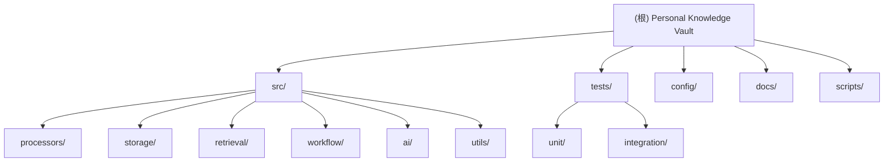

# Personal Knowledge Vault - 项目索引

> **AI-First Knowledge Workflow System**
> 工作流驱动的个人知识管理系统

**最后更新**: 2026-02-16 01:53:22

---

## 变更记录 (Changelog)

### 2026-02-16
- 生成完整的 CLAUDE.md 索引文档体系
- 添加模块结构图和导航面包屑
- 为每个核心模块生成独立的 CLAUDE.md 文档

---

## 项目愿景

构建一个以 **AI 协作**为核心的个人知识管理系统，通过**工作流编排**实现灵活的内容归档与智能检索：

- **AI-First**: 以 Claude Code/CodeX 作为智能协作伙伴，支持人机协作的知识处理
- **工作流驱动**: 一切操作皆工作流，可编排、可观测、可中断
- **智能检索**: 根据内容特点自动选择 BM25/向量/混合检索策略
- **本地优先**: 数据完全掌控，Markdown 主存储，SQLite+hnswlib 辅助索引
- **成本可控**: 智能策略节省 85% API 成本

---

## 架构总览

### 核心设计理念

**工作流驱动 + 插件化处理 + 灵活深度**

系统采用工作流引擎编排各模块，每种内容类型对应独立的处理 Pipeline，深度由内容复杂度决定而非架构强制。

### 技术栈

- **语言**: Python 3.11+ (推荐 Conda 环境)
- **存储**: Markdown (YAML Front Matter) + SQLite (FTS5) + hnswlib (向量索引)
- **AI 服务**: DeepSeek (摘要/标签提取) + OpenAI (Embedding)
- **检索**: BM25 + 向量检索 + 混合策略 (RRF 算法)
- **分词**: jieba (中文分词)

### 架构分层

```
┌─────────────────────────────────────────┐
│  用户交互层                              │
│  • Slash Commands (/kb:archive-url)    │
│  • Rich Console 界面                    │
└─────────────────┬───────────────────────┘
                  ↓
┌─────────────────────────────────────────┐
│  工作流编排层 (workflow/)                │
│  • 解析命令 → 加载 YAML 配置            │
│  • 编排步骤 → 协调各模块                │
│  • 进度追踪 → 日志记录                  │
└───┬─────────┬─────────┬─────────────────┘
    │         │         │
    ↓         ↓         ↓
┌────────┐ ┌──────┐ ┌─────────┐
│Processors│ │Retrieval│ │AI Services│
│(处理层) │ │(检索层)│ │(AI 层)  │
└────┬───┘ └───┬──┘ └────┬────┘
     │         │         │
     └─────────┼─────────┘
               ↓
      ┌────────────────┐
      │  Storage (存储层) │
      │  • Markdown      │
      │  • SQLite        │
      │  • VectorStore   │
      └────────────────┘
```

---

## 模块结构图

以下是项目的模块组织结构（点击节点可跳转到对应模块文档）:



---

## 模块索引

以下是各核心模块的功能说明和入口链接:

| 模块 | 路径 | 职责 | 文档 |
|------|------|------|------|
| **工作流引擎** | `src/workflow/` | 编排步骤、进度追踪、错误处理 | [CLAUDE.md](./src/workflow/CLAUDE.md) |
| **内容处理器** | `src/processors/` | 插件化内容抓取与解析（微信/知乎/聊天/AI 聊天） | [CLAUDE.md](./src/processors/CLAUDE.md) |
| **检索引擎** | `src/retrieval/` | BM25/向量/混合检索与智能路由 | [CLAUDE.md](./src/retrieval/CLAUDE.md) |
| **存储层** | `src/storage/` | Markdown/SQLite/Vector 三层存储 | [CLAUDE.md](./src/storage/CLAUDE.md) |
| **AI 服务** | `src/ai/` | DeepSeek 摘要/OpenAI Embedding | [CLAUDE.md](./src/ai/CLAUDE.md) |
| **工具函数** | `src/utils/` | 配置/日志/文本处理/验证脚本 | [CLAUDE.md](./src/utils/CLAUDE.md) |
| **测试** | `tests/` | 单元测试/集成测试/手动测试脚本 | [CLAUDE.md](./tests/CLAUDE.md) |
| **配置** | `config/` | 主配置/工作流配置/自定义词典 | [CLAUDE.md](./config/CLAUDE.md) |

---

## 运行与开发

### 快速开始

```powershell
# 1. 安装 Conda 环境（推荐）
.\scripts\setup-conda.ps1
conda activate pkv-py311

# 2. 配置 API Keys
notepad .env
# 填入: DEEPSEEK_API_KEY, OPENAI_API_KEY

# 3. 验证安装
.\scripts\test-conda.ps1
```

详细指南请参考:
- [RUN_ME_FIRST.md](./RUN_ME_FIRST.md) - 3 步快速开始
- [docs/core/QUICKSTART.md](./docs/core/QUICKSTART.md) - 详细安装指南

### 常用命令

```bash
# 运行所有单元测试
python -m pytest tests/unit/ -v

# 运行特定模块测试
python -m pytest tests/unit/test_processors_*.py -v

# 运行集成测试（需要 API Keys）
python -m pytest tests/integration/ -v

# 代码覆盖率测试
python -m pytest tests/unit/ --cov=src --cov-report=term-missing

# 验证环境配置
python src/utils/verify_setup.py
```

---

## 测试策略

### 测试层次

1. **单元测试** (`tests/unit/`)
   - 所有核心模块有对应测试文件
   - 使用 Mock 隔离外部依赖
   - 覆盖率目标: 80%+

2. **集成测试** (`tests/integration/`)
   - 检索引擎端到端测试
   - 工作流引擎集成测试
   - 需要真实 API Keys

3. **手动测试** (`tests/manual_test_*.py`)
   - 真实环境验证
   - AI 服务测试
   - E2E 工作流测试

### 测试数据

- 测试 fixtures: `tests/fixtures/`
- 包含微信/知乎/AI 聊天样本数据
- 测试 URL 列表: `tests/fixtures/test_urls.json`

---

## 编码规范

### 基础约定

- **类型提示**: 所有函数必须有完整的类型注解
- **文档字符串**: 公开 API 必须有 docstring（Google 风格）
- **错误处理**: 优雅降级，禁止裸 `except:`
- **环境隔离**: 始终使用虚拟环境（Conda 或 venv）

### 命名规范

- **数据库列名**: 使用领域专用名称
  - `knowledge_id` (而非 `id`)
  - `tag_id`, `chunk_id`, `timestamp_id`
  - 所有外键引用 `knowledge_id`

- **文件名**: 蛇形命名法 `snake_case`
- **类名**: 大驼峰 `PascalCase`
- **函数/变量**: 蛇形命名法 `snake_case`

### 中文文本处理

- **FTS5 查询**: 必须使用 `TextProcessor.tokenize_chinese()` 进行手动分词
- **分词工具**: 统一使用 jieba
- **自定义词典**: `config/custom_dict.txt`

### 关键模式

#### 1. Processor 模式

所有内容处理器继承自 `BaseProcessor`:

```python
class MyProcessor(BaseProcessor):
    @classmethod
    def can_handle(cls, url: str) -> bool:
        """判断是否能处理该 URL"""
        return "my-site.com" in url

    async def process(self, url: str) -> Entry:
        """处理并返回 Entry 数据类"""
        ...
```

#### 2. Entry 数据类

标准返回类型，包含:
- 基础元数据 (title, source_type, source_url)
- 内容分析 (tags, keywords, abstract)
- 多层次摘要 (summary_one_sentence, summary_100_words)
- 检索配置 (search_strategy, word_count)
- 正文内容 (content)

#### 3. 双重存储

- **主存储**: Markdown + YAML Front Matter（人类可读，Git 友好）
- **辅助存储**: SQLite (元数据索引) + hnswlib (向量检索)
- 所有数据可从 Markdown 完全重建

#### 4. 检索路由

`QueryRouter` 根据查询特征自动选择策略:
- 短查询 (<10 tokens) → BM25 (精确关键词)
- 长查询 (≥10 tokens) → Vector (语义理解)
- 混合模式 → HybridRetriever (RRF k=60)

---

## AI 使用指引

### 与 Claude Code 协作

本项目设计为与 Claude Code 深度协作:

1. **工作流步骤**: `IdeaSharpenStep` 触发交互式对话
2. **Slash Commands**: 通过 `/kb:archive-url` 等命令调用
3. **配置驱动**: 所有工作流定义在 `config/workflows/*.yaml`

### 关键约定

- **不修改源代码**: AI 仅生成/更新文档与配置
- **忽略规则**: 遵循 `.gitignore` 中定义的忽略模式
- **大文件处理**: 仅记录路径，不读取内容
- **分页策略**: 对大目录分批处理，避免超限

### 扩展点

#### 添加新处理器

```python
# src/processors/my_processor.py
from src.processors.base import BaseProcessor

class MyProcessor(BaseProcessor):
    @classmethod
    def can_handle(cls, url: str) -> bool:
        return "my-source.com" in url

    async def process(self, url: str) -> Entry:
        # 实现处理逻辑
        ...

# 在 src/processors/__init__.py 中注册
```

#### 添加新工作流

```yaml
# config/workflows/my-workflow.yaml
name: my-workflow
description: "我的自定义工作流"
steps:
  - id: fetch
    type: fetch_content
  - id: analyze
    type: ai_analyze
  - id: store
    type: store_entry
```

---

## 当前开发状态

### 已完成里程碑

- ✅ **M1**: 基础设施层（存储、配置、SQLite、向量）
- ✅ **M2**: AI 服务层（DeepSeek、OpenAI、Embedding）
- ✅ **M3**: 内容处理器（微信、知乎、通用网页、聊天）
- ✅ **M3.5**: AI 聊天处理器与文本回退
- ✅ **M4**: 检索引擎（BM25、向量、混合检索）
- ✅ **M5**: 工作流引擎（编排、步骤、上下文）
- ✅ **M5.1**: Bug 修复（配置字段、引擎传参、source_type）

### 进行中

- 🔄 **M6**: CLI 入口与交互界面
- 🔄 **M7**: 文档完善与交付

### 已知问题

参考 [docs/refactor/Bug修复记录.md](./docs/refactor/Bug修复记录.md)

---

## 关键文件

### 核心文档

| 文件 | 说明 |
|------|------|
| [docs/core/STARTER_PROMPT.md](./docs/core/STARTER_PROMPT.md) | 完整开发计划 |
| [docs/core/personal-knowledge-vault-prd.md](./docs/core/personal-knowledge-vault-prd.md) | 产品需求文档 |
| [docs/core/架构设计.md](./docs/core/架构设计.md) | 工作流驱动架构设计 |
| [docs/core/技术选型.md](./docs/core/技术选型.md) | 技术栈选型说明 |
| [docs/core/项目结构说明.md](./docs/core/项目结构说明.md) | 目录结构详解 |

### 接口规范

| 文件 | 说明 |
|------|------|
| [docs/refactor/Entry数据模型规范.md](./docs/refactor/Entry数据模型规范.md) | 知识条目数据结构 |
| [docs/refactor/Processors接口规范.md](./docs/refactor/Processors接口规范.md) | 内容处理器接口 |
| [docs/refactor/Storage接口规范.md](./docs/refactor/Storage接口规范.md) | 三层存储架构 |
| [docs/refactor/Retrieval检索引擎规范.md](./docs/refactor/Retrieval检索引擎规范.md) | 检索策略设计 |
| [docs/refactor/WorkflowEngine接口规范.md](./docs/refactor/WorkflowEngine接口规范.md) | 工作流引擎接口 |

### 配置文件

| 文件 | 说明 |
|------|------|
| [config/config.yaml](./config/config.yaml) | 主配置文件 |
| [config/workflows/archive-url.yaml](./config/workflows/archive-url.yaml) | 归档工作流配置 |
| [config/workflows/search.yaml](./config/workflows/search.yaml) | 搜索工作流配置 |

---

## 数据存储路径

### 运行时生成的数据目录

```
.data/                          # 所有运行时数据（已忽略）
├── db/
│   └── knowledge_vault.db      # SQLite 数据库
├── vectors/
│   ├── doc_vectors.idx         # 文档级向量索引
│   ├── chunk_vectors.idx       # 分块级向量索引
│   └── *_metadata.json         # ID 映射表
├── vault/                      # Markdown 文件存储
│   └── {YYYY}/{MM}/{YYYYMMDD}-{title-slug}.md
└── logs/                       # 日志文件
    └── pkv.log
```

### Markdown 文件命名规范

```
格式: {YYYYMMDD}-{title-slug}.md
示例: 20260216-ai-first-workflow.md
      20260216-深度学习入门.md
```

---

## 项目统计

### 代码规模

- **源代码文件**: 31 个 Python 文件
- **测试文件**: 25 个测试文件
- **文档文件**: 60+ 个 Markdown 文档
- **配置文件**: 4 个 YAML 配置

### 模块分布

| 模块 | 文件数 | 说明 |
|------|--------|------|
| `src/processors/` | 7 | 内容处理器 |
| `src/storage/` | 3 | 存储层 |
| `src/retrieval/` | 6 | 检索引擎 |
| `src/workflow/` | 4 | 工作流引擎 |
| `src/ai/` | 4 | AI 服务 |
| `src/utils/` | 5 | 工具函数 |
| `tests/unit/` | 18 | 单元测试 |
| `tests/integration/` | 2 | 集成测试 |
| `tests/manual_*` | 5 | 手动测试 |

### 测试覆盖率

- **单元测试覆盖**: 全部核心模块
- **集成测试覆盖**: 检索引擎、工作流引擎
- **Fixtures**: 微信/知乎/AI 聊天样本

---

## 下一步建议

### 优先任务

1. **完成 M6 CLI 入口**
   - 实现 `main.py` 命令行入口
   - 集成 Rich Console 界面
   - 实现 Slash Commands 解析

2. **完善文档体系**
   - API 使用示例
   - 故障排查指南
   - 贡献者指南

3. **性能优化**
   - 向量索引批量更新
   - SQLite 查询优化
   - 长文档分块策略

### 扩展方向

- **新内容源**: B站视频、PDF 书籍、Twitter
- **新检索策略**: 结构化查询（视频时间点跳转）
- **新 AI 能力**: 概念提取、知识图谱

---

## 相关链接

- [GitHub Repository](https://github.com/yourusername/personal-knowledge-vault)
- [开发计划](./docs/core/STARTER_PROMPT.md)
- [更新日志](./docs/CHANGELOG.md)
- [问题跟踪](./docs/refactor/Bug修复记录.md)

---

**文档版本**: v2.0
**生成时间**: 2026-02-16 01:53:22
**项目代号**: Personal Knowledge Vault

*本文档由 Claude Code 自动生成并维护*
