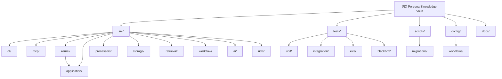

# Personal Knowledge Vault - 项目索引

> **AI-First Knowledge Workflow System**
> 工作流驱动的个人知识管理系统

**最后更新**: 2026-08-21

---

## 变更记录 (Changelog)

### 2026-08-21（K1a/K2/K1b 与 R1–R4 内部隔离验证）

- K1a/K2/K1b 与 R1–R4 的定向回归及最终默认隔离全量回归均已通过：`3182 passed, 21 skipped, 219 deselected, 35 warnings`（exit 0）。K1b 只证明本地 wheel/source-free clean-install 兼容，不是 PyPI、安装器或 release 资格。
- R2 的 CLI 适配层已补齐未创建嵌套 data root 的 fresh-root 回归，覆盖 setup plan、plan-only 零写、PLAN_ID 与 `--allow-network` 门禁；测试只使用合成 Config/fake executor，不触发 Provider、迁移或真实网络。
- R3 已覆盖受支持的业务/数据写入路径：竞争写入返回 `write_busy`，读操作可继续；这不等同于所有文件系统写入均已串行化。运行时日志写入归属和遗留维护写入口仍是 R3.1 P1 hardening。
- R4 仍仅为 runtime-internal staged core；公开 rebuild adapter、自动清理和公开 rollback 均属未来工作。所有验证只使用 `.data-test`、合成数据与 fake Provider，不改变 release hold、PyPI 或 stdio-only 合同。

### 2026-08-18（GUI 剥离后的 Core 重测与路线重排）

- Core 默认离线重测为 `2947 passed, 21 skipped, 219 deselected`；Application/Kernel/CLI
  定向回归为 `300 passed`，MCP 三层回归为 `762 passed`。唯一发现的旧 CLI
  `WorkflowEngine` mock 已迁移到 `get_application(...).archive_cli_input(...)` seam。
- GUI 已保持在独立 `pkv-GUI` 仓库；Core 下一项工作改为把 `pkv_kernel` 固化为可安装、
  版本化且有兼容性合同的 SDK，随后才进行 config snapshot/reload hardening 与知识成果主线。

### 2026-08-19（K1a/K2 公开边界与 reload 合同）

- K1a 已冻结 `pkv_kernel` API-major-1 的公开清单、SDK 版本/能力握手、兼容和废弃规则；
  外部 Wrapper 仍只可导入 `pkv_kernel`，不依赖 `src.*`、CLI、MCP 或 GUI。
- K2 已把默认 Application/Kernel reload 收敛为原子 snapshot 发布：旧 in-flight 操作保留
  原 config graph，新 Kernel 以递增 generation 承载新图；显式 Config B 与 legacy Config A
  可隔离并存，向量 absent → archive-created → related/delete 状态转换不负缓存。
- 下一个工作包是 K1b：仅做离线本地 wheel 与 clean-install 兼容验证，不是发布、PyPI 或
  release-hold 变更。

### 2026-08-19（K1b 本地 wheel / clean-install 合同）

- 新增 `pkv-kernel` 本地 distribution 元数据与资源构建 hook：wheel 只带 headless Kernel
  所需闭包和显式 allowlist 的配置、工作流、迁移与 Prompt，拒绝 `local.yaml`、CLI、MCP、
  GUI、PySide6 与 qasync payload。
- K1b 合同在仓库外临时目录离线构建 wheel，并用 clean venv 的 `-I` 子进程验证已安装
  `pkv_kernel` 的版本/能力握手、wheel 内资源根和 `bootstrap_kernel()`；所有 PKV 数据仍在
  `.data-test` 合成根。当次 K1b 变更后的默认离线回归为 `2954 passed, 21 skipped, 219 deselected`。它不验证
  依赖索引，也不构成发布、PyPI 或 release-hold 变更。

### 2026-08-13（文档入口与当前版本收敛）

- 当前运行时、CLI 与 held test candidate 的版本口径统一为 `0.8.1`；历史
  `v0.8.0-alpha` 条目仍保留其原始时间语境，不再表示当前基线。
- 根 `AGENTS.md` 改为可移植的 Agent 入口，并为各核心模块补齐
  `AGENTS.md` 转接页；既有模块 `CLAUDE.md` 继续是其规范性说明来源。
- 用户配置与默认数据根已由
  [ADR：用户配置与运行数据布局](./docs/overview/ADR-用户配置与运行数据布局-2026-08.md)
  定义；它覆盖此前“待决”的路径口径。held release candidate 的历史
  `%LOCALAPPDATA%` 布局仍仅是历史证据，不能被当作当前产品政策。

### 2026-07-31 (P0 自动化 G0/FT7 收口)

- 默认自动化统一经 `scripts/run-test.ps1`；pytest 在加载 pytest/plugin 前先经 `tests/offline_entrypoint.py pytest` 建立 G0，再由根 `tests/conftest.py` 维持逐用例隔离；CLI/MCP 也由 offline entrypoint 启动
- Direct Python（FT7）建立了受保护的离线入口；当前执行范围已收窄为显式离线测试白名单（见 `scripts/CLAUDE.md`），其余仓库模块/脚本会在创建 DataRoot 前拒绝；仍拒绝 `-c`/stdin/解释器 flags，并由同进程 `runpy` 在产品导入前落实环境清理、base-only Config、网络及子进程 guard
- Python guard 不是 OS sandbox；非 Python Direct 仍须经 wrapper 启动，但不属于 Python G0、不保证离线
- `setup-test-db.py` 输出精确绑定所选 `DATA_DIR`；`rebuild-dev-vault.py` 同样要求 FT7 attestation 且 `--root` 只能位于所选 `DATA_DIR`；`migrate.py` 仍被测试包装器以 exit 2 拒绝
- 真实迁移仍受 U1/G8/FT5 user-only gate 阻塞，尚未执行真实数据迁移

### 2026-07-31 (P1 扫描 fail-closed 收口)

- 内部链接扫描失败处理收紧：`entry.is_dir` 的 OSError 不再 continue 吞掉，任何扫描权限/IO 错误一律 fail-closed 以 RootRejectedError（exit 2）拒绝，绝不继续读取 manifest/db/SQLite
- 新增 scoped 测试：模拟 scandir 失败与 is_dir 失败（monkeypatch），验证拒绝且不进入后续校验/读取
- 测试增至 34 例

### 2026-07-31 (P1 内部链接安全门)

- 修复 Blocker：root 内 rebuild-manifest.json / db 目录 / db 文件若为 symlink/junction/hardlink 指向 .data，非 force 与 check-only 路径可能在递归链接校验前跟随并读取生产路径
- 新增只读递归内部链接扫描 `_find_unsafe_link_under`：在任何内容读取（iterdir/manifest/DB）之前执行并立即拒绝（exit 2），不跟随子项链接；覆盖 check-only / 非 force 幂等 / force 三条路径
- 测试增至 32 例（manifest/db 硬链接识别、check-only 与幂等路径的顺序拒绝、junction db 目录拒绝等）

### 2026-07-31 (P1 fail-closed 修订)

- 修复 fail-open：非空但不完整/未知的 root（如仅 sentinel.txt、无 db）不再被 health check 误判为 up_to_date
- 新增版本化 `rebuild-manifest.json`（合成重建元数据）：校验 DB、vault、schema/迁移状态（pending 不算最新）、seed 条目数或 no-seed 情况；缺失/损坏/漂移一律拒绝
- 非空且未通过结构校验的 root 不带 `--force` 一律拒绝（exit 1，JSON 带 error/phase），不写入、不清理；`--check-only` 对缺失/不完整 DB 必须失败且绝不创建文件
- 测试增至 26 例（sentinel-only、缺失 DB check-only、无效 manifest、seed 漂移、pending migrations、no-seed 可验证等）

### 2026-07-31 (P1 安全收紧修订)

- 移除 `--allow-outside-repo` 旁路：重建根严格限定为仓库 `.data-test` 专用子目录，仓库外路径一律拒绝
- 危险目标拒绝改为纯字符串判断（不 resolve/stat）；测试删除所有对仓库 `.data` 的路径访问，改为字符串级 + monkeypatch/监控契约
- 测试重建改用 `.data-test` 下受控临时子目录（测后清理），外部临时目录仅用于验证拒绝行为

### 2026-07-31 (P1 开发专用轻量重建)

- 新增 `scripts/rebuild-dev-vault.py`：隔离根上的 清理→迁移→确定性最小种子→健康检查 重建入口
- 默认根 `.data-test/rebuild-dev`；拒绝 `.data`、仓库外与危险目标；幂等可重复；`--json` 结果契约
- 新增并持续加固离线测试 `tests/unit/test_rebuild_dev_vault.py`：覆盖临时根隔离、幂等、危险目标拒绝、完整性、只读检查与运行时 `tmp` 保留合同
- 文档：`scripts/README.md`、`scripts/CLAUDE.md` 更新操作说明

### 2026-02-23 10:45

- M12 完成：AI 对话完整实现 -- 流式输出 + 知识引用 + URL 归档 + 会话管理
- 新增 `src/gui/` 模块扩展：ChatView、ChatViewModel、AutocompletePopup、knowledge_ref、theme_colors
- 新增 `scripts/migrations/004_add_chat_sessions.sql` 数据库迁移
- 新增 `scripts/setup-test-db.py` 测试数据生成脚本
- 新增 MCP E2E 测试体系：conftest.py + 3 个 E2E 测试文件
- 新增 M12 手动测试目录 `tests/manual_test_m12/` (6 个脚本)
- 新增 GUI 单元测试：test_chat_viewmodel.py, test_knowledge_ref.py, test_autocomplete_popup.py
- 新增 GUI 模块 CLAUDE.md 文档
- 版本号升级至 v0.8.0-alpha

### 2026-02-19 00:58

- M8 + M9 完成：MCP 服务层（只读 + 写入 + Prompt + 安全加固）
- 新增 `src/mcp/` 模块（server.py, tools.py, resources.py, prompts.py, utils.py, __main__.py）
- 新增三层 MCP 测试体系：单元 4 文件 + 集成 2 文件 + 黑盒 1 文件（共 203 tests）
- 新增 `config/workflows/archive-text.yaml` 工作流配置
- `src/storage/vector_store.py` 新增 `get_doc_vector()` 方法
- 版本号升级至 v0.7.0

### 2026-02-16 18:51

- 基于 v0.6.1 和 M6+M7 完成情况全面更新索引体系
- 新增 CLI 模块、Scripts 运维脚本、数据库迁移管理器的完整文档
- 更新模块结构图,体现 AI 安全测试和数据库迁移系统
- 补充测试覆盖率统计和最新的项目规模数据

### 2026-02-16 01:53

- 生成完整的 CLAUDE.md 索引文档体系
- 添加模块结构图和导航面包屑
- 为每个核心模块生成独立的 CLAUDE.md 文档

---

## 项目愿景

构建一个以 **AI 协作**为核心的个人知识管理系统,通过**工作流编排**实现灵活的内容归档与智能检索:

- **AI-First**: 以 Claude Code/CodeX 作为智能协作伙伴,支持人机协作的知识处理
- **工作流驱动归档**: 真实版本化 YAML 编排 URL/文本归档；搜索由 Retrieval 层直接执行
- **智能检索**: 根据内容特点自动选择 BM25/向量/混合检索策略
- **本地优先**: 数据完全掌控,Markdown 主存储,SQLite+hnswlib 辅助索引
- **成本可控**: BM25 路径不构造 Provider，向量/混合能力按需启用
- **安全可靠**: 测试环境隔离、自动备份、数据库增量迁移
- **MCP 开放**: 通过 MCP 协议将知识库暴露给任意 AI Agent
- **外部桌面 Wrapper**: GUI 已独立到 `pkv-GUI` 仓库，只依赖本仓库的稳定 Kernel 接口

---

## 架构总览

### 核心设计理念

**无头 Kernel + 工作流驱动 + 插件化处理 + AI 安全协作 + 外围适配器**

系统由 `src/kernel` 提供稳定、无头的产品能力边界，内部经共享 application composition 组装工作流、处理器、检索、AI 与存储。桌面 GUI 已独立到相邻的 `pkv-GUI` 仓库，像 LM Studio 围绕 llama.cpp 一样只消费 Kernel 端口；本仓库不再包含 Qt 代码或 GUI 封包入口。

M13 当前支持边界：MCP 只发布 stdio，不发布 HTTP/Bearer；Workflow 只加载 `config/workflows/` 下真实、版本化的 `archive-url.yaml` 与 `archive-text.yaml`，不支持 `search.yaml`。向量/混合检索由 CLI/MCP 显式策略消费，并在实际需要时才构造 Provider。默认自动化必须离线，只使用合成数据和隔离数据根，不读取真实 key、Provider 或 Vault。

### 技术栈

- **语言**: Python 3.11+ (推荐 Conda 环境)
- **CLI 框架**: Click 8.0+ (Rich 终端界面)
- **MCP 框架**: FastMCP (mcp SDK) -- M13 Developer Preview 仅发布 stdio
- **存储**: Markdown (YAML Front Matter) + SQLite (FTS5) + hnswlib (向量索引)
- **AI 服务**: DeepSeek (摘要/标签/对话) + OpenAI (Embedding)
- **检索**: BM25 + 向量检索 + 混合策略 (RRF 算法)
- **分词**: jieba (中文分词)
- **安全**: URL 全链路 SSRF 重校验 + 文本长度验证 + 离线测试隔离

### 架构分层

CLI/MCP 是本仓库的外围适配器；外部 GUI Wrapper 也只经 `pkv_kernel`
调用无头能力。Kernel 再经 `src.application` 组装同一份已验证 config
下的 Workflow/Processor/Retrieval/AI/Storage 依赖。Kernel 不得反向导入任何 Wrapper。

```
┌─────────────────────────────────────────┐
│  CLI 交互层 (src/cli/)                   │
│  + Click 命令组 (archive/search/...)    │
│  + Rich 终端界面 (进度条/表格/面板)      │
├─────────────────────────────────────────┤
│  MCP 服务层 (src/mcp/)        [M8+M9]  │
│  + 15 Tools (13只读 + 2写入)            │
│  + 9 Resources (正文/chunk/关系/统计等)  │
│  + 3 Prompts (搜索总结/知识问答/思想磨砺)│
│  + 安全层 (SSRF 重校验/文本验证)        │
└─────────────────┬───────────────────────┘
                  ↓
┌─────────────────────────────────────────┐
│  工作流编排层 (src/workflow/)            │
│  + 解析命令 → 加载 YAML 配置            │
│  + 编排步骤 → 协调各模块                │
│  + 进度追踪 → 日志记录                  │
└───┬─────────┬─────────┬─────────────────┘
    │         │         │
    ↓         ↓         ↓
┌────────┐ ┌──────┐ ┌─────────┐
│Processors│ │Retrieval│ │AI Services│
│(处理层) │ │(检索层)│ │(AI 层)  │
└────┬───┘ └───┬──┘ └────┬────┘
     │         │         │
     └─────────┼─────────┘
               ↓
      ┌────────────────┐
      │  Storage (存储层) │
      │  + Markdown      │
      │  + SQLite        │
      │  + VectorStore   │
      └────────────────┘
               ↓
      ┌────────────────┐
      │ 运维与安全层     │
      │ + 测试环境隔离   │
      │ + 自动备份/恢复  │
      │ + 数据库迁移     │
      └────────────────┘
```

---

## 模块结构图

以下是项目的模块组织结构(点击节点可跳转到对应模块文档):



---

## 模块索引

| 模块 | 路径 | 职责 | 文档 |
| ------ | ------ | ------ | ------ |
| **无头 Kernel** | `src/kernel/` | 稳定产品操作与外围 Wrapper 端口 | [CLAUDE.md](./src/kernel/CLAUDE.md) |
| **Application 组合** | `src/application/` | 同一 validated config 下的惰性依赖与工作流组装 | [CLAUDE.md](./src/application/CLAUDE.md) |
| **CLI 交互层** | `src/cli/` | Click 命令行界面、Rich 终端 UI | [CLAUDE.md](./src/cli/CLAUDE.md) |
| **MCP 服务层** | `src/mcp/` | MCP stdio -- 15 Tool（13 只读 + 2 写入）+ 9 Resource + 3 Prompt + 安全加固 | [CLAUDE.md](./src/mcp/CLAUDE.md) |
| **工作流引擎** | `src/workflow/` | 编排步骤、进度追踪、错误处理 | [CLAUDE.md](./src/workflow/CLAUDE.md) |
| **内容处理器** | `src/processors/` | 插件化内容抓取与解析(微信/知乎/聊天/AI 聊天/文本回退) | [CLAUDE.md](./src/processors/CLAUDE.md) |
| **检索引擎** | `src/retrieval/` | BM25/向量/混合检索与智能路由 | [CLAUDE.md](./src/retrieval/CLAUDE.md) |
| **存储层** | `src/storage/` | Markdown/SQLite/Vector 三层存储 + 数据库迁移管理 | [CLAUDE.md](./src/storage/CLAUDE.md) |
| **AI 服务** | `src/ai/` | DeepSeek 摘要/OpenAI Embedding | [CLAUDE.md](./src/ai/CLAUDE.md) |
| **工具函数** | `src/utils/` | 配置/日志/文本处理/验证脚本 | 根级索引（无独立模块文档） |
| **运维脚本** | `scripts/` | 环境搭建/数据备份恢复/数据库迁移/测试环境管理 | [CLAUDE.md](./scripts/CLAUDE.md) |
| **测试** | `tests/` | 单元测试/集成测试/E2E/黑盒测试 | [CLAUDE.md](./tests/CLAUDE.md) |
| **配置** | `config/` | 主配置/工作流配置/自定义词典 | [CLAUDE.md](./config/CLAUDE.md) |

---

## 运行与开发

### 快速开始

```powershell
# 1. 安装 Conda 环境(推荐)
.\scripts\setup-conda.ps1

# 2. 用户手工配置唯一的私有 YAML（绝不由默认测试读取）
notepad $env:USERPROFILE\.pkv\config.yaml
# 填入 ai.llm.* 与 ai.embedding.*；<data-root>\config\local.yaml
# 是 PKV 管理的无密钥 runtime snapshot，不能手工当作业务配置编辑

# 3. 验证安装
.\scripts\test-conda.ps1

# 以下 AI/自动化示例统一使用隔离数据根目录；真实用户 data root 仅由用户明确授权后操作

# 4. 使用 CLI（隔离测试数据）
.\scripts\run-test.ps1 -Direct -DataRoot .data-test\quickstart -Command @("python", "-m", "src.cli.commands", "--help")
.\scripts\run-test.ps1 -DataRoot .data-test\quickstart stats
.\scripts\run-test.ps1 -DataRoot .data-test\quickstart search "关键词" --strategy bm25

# 5. 启动 MCP Server (Claude Code / Cursor 集成，隔离测试数据)
.\scripts\run-test.ps1 -Direct -DataRoot .data-test\quickstart -Command @("python", "-m", "src.mcp.server")
```

### Codex/Claude 运行环境

为 AI 协作者准备的专用环境：

```bash
conda create -y -n py311-private python=3.11
conda install -y -n py311-private -c conda-forge hnswlib=0.8.0
conda run -n py311-private python -m pip install -r requirements.txt
conda activate py311-private
```

### 常用命令

以下示例面向 AI/自动化协作，数据相关命令默认使用隔离测试路径。当前有效用户 `<data-root>`（默认 `%USERPROFILE%\.pkv\data`）的查询或迁移必须由用户明确授权并执行，AI 不执行。

```powershell
# CLI 命令（测试数据）
.\scripts\run-test.ps1 stats
.\scripts\run-test.ps1 search "AI 工作流" --strategy bm25
.\scripts\run-test.ps1 list --limit 10
.\scripts\run-test.ps1 stats

# MCP Server（隔离测试数据，stdio 模式）
.\scripts\run-test.ps1 -Direct -DataRoot .data-test\dev -Command @("python", "-m", "src.mcp.server")

# 数据库迁移
# 遗留 migrate.py 已停用：裸调用和 run-test.ps1 都会在读取 Config/数据库前 fail-closed（exit 2）。
# 真实迁移须等待未来 user-only lifecycle 入口、U1/G8/FT5 与用户授权；尚未执行真实数据迁移。

# 测试环境
.\scripts\run-test.ps1 stats
.\scripts\run-test.ps1 -Direct -DataRoot .data-test\seed -Command @("python", "scripts/setup-test-db.py", "--seed", "42", "--count", "20", "--output", ".data-test/seed/db/knowledge_vault.db")
# setup-test-db.py 的输出必须精确绑定上述 DataRoot

# 运行测试
.\scripts\run-test.ps1 -Direct -DataRoot .data-test\root-unit -Command @("pytest", "tests/unit/", "-v")
.\scripts\run-test.ps1 -Direct -DataRoot .data-test\root-e2e -Command @("pytest", "tests/e2e/", "-v")
.\scripts\run-test.ps1 -Direct -DataRoot .data-test\root-cov -Command @("pytest", "tests/", "--cov=src", "--cov-report=term-missing")
```

---

## 测试策略

### 测试层次

1. **单元测试** (`tests/unit/`)
2. **集成测试** (`tests/integration/`)
3. **E2E 测试** (`tests/e2e/`，默认排除 `network/manual`)
4. **黑盒测试** (`tests/blackbox/`)
5. **手动测试** (`tests/manual_test_*.py`，用户手动、非默认自动化)

### MCP 三层测试体系

| 层级 | 文件 | 说明 |
| ------ | ------ | ------ |
| **Layer 1** 单元测试 | `test_mcp_tools/resources/prompts/security.py` | Mock 隔离 |
| **Layer 2** 进程内集成 | `test_mcp_functional/integration.py` | FastMCP 调用 |
| **Layer 3** stdio 黑盒 | `test_mcp_blackbox.py` | JSON-RPC over stdio |

### 覆盖率

不在索引文档中维护易漂移的静态百分比；以 [tests/CLAUDE.md](./tests/CLAUDE.md)
记录的同一冻结工作树全量回归与 MCP 覆盖率门禁为准。

---

## 编码规范

### 关键模式

1. **Processor 模式**: `BaseProcessor.can_handle()` + `process()` -> `Entry`
2. **双重存储**: Markdown 主存储 + SQLite/Vector 辅助索引
3. **检索路由**: `QueryRouter` 自动选择 BM25/Vector/Hybrid
4. **MCP 异步**: `@mcp.tool` + `anyio.to_thread.run_sync()` 包装同步 I/O

### 命名规范

- 数据库列名: `knowledge_id`, `session_id`, `tag_id` (领域驱动)
- 文件名: `snake_case` / 类名: `PascalCase` / 函数: `snake_case`
- FTS5 查询: 必须使用 `TextProcessor.tokenize_chinese()` 手动分词

---

## AI 使用指引

### AI 安全规范

1. 禁止直接操作用户数据根（当前有效 `<data-root>`；默认 `%USERPROFILE%\.pkv\data`）
2. 强制使用测试环境 (`run-test.ps1`)
3. 重要变更前必须备份 (`backup-data.ps1`)
4. MCP: stdio-only + URL 全链路 SSRF 重校验 + 文本验证；HTTP/Bearer 不在 M13 发布面
5. pytest 先经 offline pytest bootstrap，再使用根 conftest；CLI/MCP 使用 offline entrypoint
6. Direct Python 不是通用仓库脚本运行器：只允许 pytest 及 `scripts/CLAUDE.md` 所列的显式离线测试目标（`src.cli.commands`、`src.mcp.server`、`src.utils.verify_setup`、`evals.mcp_quality`、`setup-test-db.py`、`rebuild-dev-vault.py` 和受控 consistency checker）；其余仓库模块/脚本会在创建 DataRoot 前拒绝。FT7 不是 OS sandbox；非 Python Direct 仍须经 wrapper，但不属于 Python G0、不保证离线

详见: [.ai-safety-rules.md](./.ai-safety-rules.md)

---

## 当前开发状态

### 当前版本: 0.8.1 (2026-08-13 事实核验)

**已完成**: M1-M12，以及 M13 W1-W4 的 runtime、源代码合同、可复现
held test candidate 打包和 installed-Artifact 功能验证。该 W4 证据属于拆分前
的历史 candidate；当前工作树的 headless 打包合同已更新，但不把历史 Artifact
证据挪用为新 payload 的发布证明。

| 里程碑 | 内容 | 日期 |
| -------- | ------ | ------ |
| M1-M5 | 核心后端 (存储/AI/处理器/检索/工作流) | 2026-02-10~15 |
| M6-M7 | CLI + 文档 | 2026-02-16 |
| M8-M9 | MCP Server (8T+4R+3P+安全) | 2026-02-19 |
| M10-M11 | GUI 框架 + 功能视图 | 2026-02-20 |
| **M12** | **AI 对话 + 完整测试框架** | **2026-02-23** |
| **M13 W1-W4** | Runtime 安全、源代码合同、可复现打包与 Artifact E2E | **2026-08-02~11** |

### 下一步

1. **M13 release hold**：候选仍是 `test_candidate`，当前合规合同中的 3 项 blocker 未关闭，
   `release_eligible=false`、`decision=hold`；当前不安排合规收口或正式发布。
2. **后 M13 P1-A/P1-C 已完成**：共享应用服务、内部自测封包和 GUI 完整剥离均已完成；
   Core 仅以合成数据完成 headless 重测。这不构成发布或 held-candidate 状态变化。
3. **S0 / K1a / K2 / K1b 内部 checkpoint**：`pkv_kernel` 的公开 API/版本能力握手、config
   snapshot/reload 与本地 wheel/source-free clean-install 已完成隔离验证；外部 Wrapper
   始终不得依赖相邻 checkout 或 `src.*`。这不授予 PyPI、发布或安装兼容承诺。
4. **R1 → R4 限定运行时 checkpoint**：三平面配置与换根门禁、inspect/plan/confirm/execute、
   受支持业务/数据写入的 lease、`write_busy`、审计和 Embedding staged generation 已通过最终
   默认隔离全量回归。R3.1 的运行时日志写入归属与遗留维护 writer 仍是 P1；R4 仍仅是
   runtime-internal 合同，不新增 Kernel、CLI 或 MCP 的公共重建动作。
5. **随后：知识成果**：在 R3.1 与实际需要的 R4 public-adapter gate 明确收口后，从
   `Topic / Claim / Evidence / Outcome` 的最小合同开始，将现有证据和关系能力收束为可审阅、
   可追溯的成果工作流；`partial-v1` 仍须按真实场景逐 Tool 补 full 语义与专属评测。
6. **Windows-first 与可选 Node / Docker**：当前自动化与内部验证只以 Windows 为支持基线；完整跨平台测试工程留待 Rust 代码版本再重新评估。桌面封包、Qt/OS smoke、生命周期和升级策略只在 `pkv-GUI` 仓库演进；只有后台任务、并发写入或资源复用出现可测需求，且单写者与持久任务前置完成后才评估 Node；Docker 与云端进一步后置。
7. **个人运行布局**：唯一用户配置是 `%USERPROFILE%\\.pkv\\config.yaml`，默认 data
   root 是 `%USERPROFILE%\\.pkv\\data`；`PKV_DATA_ROOT`/`PKV_LOG_LEVEL` 是正式环境
   覆盖，`<data-root>\\config\\local.yaml` 仅保存无密钥 runtime snapshot。迁移、旧目录
   接管和实际初始化必须经过 inspect → plan → 展示影响/备份 → 用户确认 → execute。

---

**文档版本**: v5.7
**最近核验**: 2026-08-21
**项目代号**: Personal Knowledge Vault
**当前版本**: 0.8.1

*本文档由 Claude Code 自动生成并维护*
