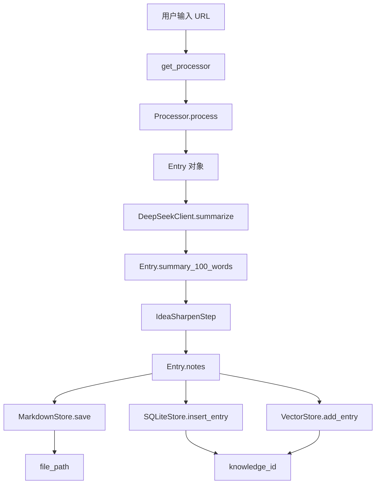

# M1-M5 整理复盘 Prompt

> **目标**: 全面梳理已完成模块的接口、数据流、规范，为 M6-M7 开发建立清晰的基础
>
> **版本**: 1.0
> **创建日期**: 2026-02-15
> **适用对象**: Claude Code/CodeX 等 AI 开发工具

---

## 🎯 复盘目标

通过系统化整理 M1-M5 的成果，达到以下目标：

1. **明确接口契约** - 每个模块的输入输出清晰定义
2. **理清数据流** - 端到端的数据传递路径可追溯
3. **统一规范** - 命名、格式、错误处理保持一致
4. **发现问题** - 识别设计不一致、接口冗余、缺失文档
5. **建立基线** - 为 M6-M7 提供可靠的依赖基础

---

## 📋 复盘清单

### 1. 核心数据模型梳理

**任务**: 整理并文档化所有核心数据类

#### 1.1 Entry 数据类

**文件位置**: `src/storage/markdown_store.py`

**需要整理的内容**:
- [ ] 完整字段列表及类型注解
- [ ] 必填字段 vs 可选字段
- [ ] 字段语义和取值范围
- [ ] 默认值规则
- [ ] 与 Markdown Front Matter 的映射关系

**输出文档**: `docs/refactor/Entry数据模型规范.md`

**检查点**:
```python
@dataclass
class Entry:
    """知识条目数据类 - 核心数据模型"""

    # 必填字段
    title: str           # 标题（不能为空）
    content: str         # 正文内容（不能为空）
    source_url: str      # 来源 URL（唯一标识）

    # 可选字段
    author: Optional[str] = None
    publish_time: Optional[str] = None
    summary_100_words: Optional[str] = None
    # ... 其他字段

    # 字段约束？默认值？验证规则？
```

---

#### 1.2 WorkflowResult 数据类

**文件位置**: `src/workflow/models.py`

**需要整理的内容**:
- [ ] success, data, errors, logs 字段语义
- [ ] errors 列表的格式约定
- [ ] data 字典的键值规范
- [ ] 与上下文 State 的关系

**输出文档**: `docs/refactor/Workflow数据模型规范.md`

---

#### 1.3 SQLite Schema

**文件位置**: `src/storage/sqlite_store.py`

**需要整理的内容**:
- [ ] 所有表结构定义（CREATE TABLE 语句）
- [ ] 主键、外键、唯一约束
- [ ] 索引定义
- [ ] 列名命名规范（knowledge_id vs id）
- [ ] 数据类型选择（TEXT vs BLOB, INTEGER vs REAL）

**输出文档**: `docs/refactor/SQLite_Schema完整规范.md`

**当前已知问题**:
- ⚠️ `knowledge_id` vs `id` 命名不一致（已有迁移计划）
- ⚠️ `keywords` 字段类型（逗号分隔字符串 vs JSON）

---

### 2. 接口规范梳理

**任务**: 明确每个模块的公共 API

#### 2.1 Processors 模块

**文件位置**: `src/processors/`

**需要整理的内容**:
- [ ] `BaseProcessor` 抽象接口定义
- [ ] `can_handle(url)` 方法规范
- [ ] `process(url)` 方法输入输出
- [ ] `get_processor(url)` 工厂函数规范
- [ ] 异常处理约定

**输出文档**: `docs/refactor/Processors接口规范.md`

**示例格式**:
```markdown
### BaseProcessor 接口

#### can_handle(url: str) -> bool

**作用**: 判断处理器是否能处理该 URL

**输入**:
- url: str - 待处理的 URL

**输出**:
- bool - True 表示可以处理，False 表示不能

**约定**:
- 必须是类方法 (@classmethod)
- 不应抛出异常，返回 False 即可
- 优先级由注册顺序决定

#### async process(url: str) -> Entry

**作用**: 处理 URL 并返回结构化数据

**输入**:
- url: str - 待处理的 URL

**输出**:
- Entry - 结构化的知识条目

**异常**:
- ValueError - URL 格式错误
- ProcessorError - 处理失败

**约定**:
- 必须是异步方法 (async def)
- 网络错误应重试 3 次
- 失败时抛出明确的异常
```

---

#### 2.2 AI 服务模块

**文件位置**: `src/ai/`

**需要整理的内容**:
- [ ] `DeepSeekClient` 接口定义
  - `summarize(text, max_words)` 规范
  - `extract_tags(text, num_tags)` 规范
- [ ] `Embedder` 接口定义
  - `embed_document(text)` 规范
  - `embed_chunks(text, return_chunks)` 规范
- [ ] 错误处理和重试策略
- [ ] API Key 获取方式

**输出文档**: `docs/refactor/AI服务接口规范.md`

---

#### 2.3 Storage 模块

**文件位置**: `src/storage/`

**需要整理的内容**:
- [ ] `MarkdownStore` 接口
  - `save(entry)` 输入输出
  - `load(file_path)` 规范
  - 文件命名规则
- [ ] `SQLiteStore` 接口
  - `insert_entry(entry, file_path)` 规范
  - `query_by_*` 方法列表
  - 事务处理规范
- [ ] `VectorStore` 接口
  - `add_doc_vector(knowledge_id, vector)` 规范
  - `search(query_vector, top_k)` 规范

**输出文档**: `docs/refactor/Storage接口规范.md`

**关键问题**:
- ❓ `insert_entry` 返回值是什么？knowledge_id 还是 row_id？
- ❓ `save` 方法如果文件已存在怎么办？覆盖还是报错？

---

#### 2.4 Retrieval 模块（M4 检索引擎）

**文件位置**: `src/retrieval/`

**需要整理的内容**:
- [ ] `QueryRouter` 路由规则
  - 路由决策逻辑（token 数量阈值：< 10 tokens → BM25, ≥ 10 tokens → Vector）
  - 默认策略选择（auto 模式）
  - 策略覆盖机制
- [ ] `BM25Retriever` 接口
  - `search(query, top_k)` 方法规范
  - 中文分词策略（jieba + 空格连接）
  - FTS5 查询语法（MATCH 语句）
  - 得分归一化
- [ ] `VectorRetriever` 接口
  - `search(query_vector, top_k)` 方法规范
  - 向量化流程（OpenAI Embedding）
  - hnswlib 相似度计算
  - 结果排序规则
- [ ] `HybridRetriever` RRF 算法
  - Reciprocal Rank Fusion 实现
  - 权重配置（k=60 默认值）
  - 结果合并规则
  - 去重机制
- [ ] 统一的搜索结果格式
  - RetrievalResult 数据类
  - 必填字段（knowledge_id, score, title, content）
  - 可选字段（tags, source_url, metadata）
  - 得分归一化规范

**输出文档**: `docs/refactor/Retrieval检索引擎规范.md`

**关键问题**:
- ❓ 如何调优 RRF 的 k 参数？
- ❓ BM25 和 Vector 的默认 top_k 值是否一致？
- ❓ 如何处理空查询结果？

---

#### 2.5 Workflow 模块（M5 工作流引擎）

**文件位置**: `src/workflow/`

**需要整理的内容**:
- [ ] `WorkflowEngine` 核心接口
  - `execute_async(workflow_name, input_data)` 异步执行规范
  - `execute(workflow_name, input_data)` 同步包装规范
  - 配置加载和缓存机制（_load_workflow_config）
  - 配置规范化（_normalize_config）
  - 错误收集和日志记录
- [ ] `BaseStep` 抽象接口
  - `__init__(step_id, config)` 构造函数规范
  - `execute(context)` 抽象方法定义
  - `_log(message)` 日志方法规范
  - `get_config()` 全局配置访问
- [ ] `WorkflowContext` 生命周期
  - 初始化时机和参数
  - State 数据管理
  - 日志收集机制
  - 错误记录机制
- [ ] State 数据传递约定
  - State 类的 get/set 方法
  - 步骤间数据键名约定（url, entry, knowledge_id, file_path 等）
  - 数据类型约定
  - 可选数据的默认值
- [ ] 工作流配置格式规范
  - 完整格式（id, type, config, on_error）
  - 简化格式（字符串数组）
  - 配置规范化规则
  - 步骤配置字段约定（targets, skip_conditions 等）
- [ ] 4 个核心步骤实现
  - `FetchStep`: 集成 processors
  - `AnalyzeStep`: 集成 AI 服务
  - `IdeaSharpenStep`: 人机交互实现（触发规则、超时处理）
  - `StoreStep`: 多后端存储（targets 配置）

**输出文档**: `docs/refactor/WorkflowEngine接口规范.md`

**关键问题**:
- ✅ 已修复：步骤构造函数接收 `config` 字段而非整个 `step_config`
- ✅ 已修复：配置字段名统一为 `targets`
- ❓ WorkflowContext 的生命周期管理？
- ❓ 步骤间的依赖声明机制？
- ❓ 如何扩展新的步骤类型？
- ❓ idea Sharpen 的触发规则是否需要配置化？

---

### 3. 数据流梳理

**任务**: 绘制端到端数据流图

#### 3.1 归档流程数据流

**输出文档**: `docs/refactor/归档流程数据流图.md`

**需要包含的内容**:


**详细说明**:
- 每个节点的输入输出类型
- 数据转换规则
- 可选步骤的条件
- 错误处理路径

---

#### 3.2 搜索流程数据流

**输出文档**: `docs/refactor/搜索流程数据流图.md`

**需要包含的内容**:
- 查询文本 → 分词/向量化
- 路由决策（BM25 vs Vector）
- 检索执行
- 结果合并（RRF）
- 结果格式化

---

### 4. 命名规范统一

**任务**: 识别并统一命名不一致的地方

#### 4.1 数据库字段命名

**检查清单**:
- [ ] 主键命名：`knowledge_id` vs `id`
- [ ] 外键命名：`knowledge_id` 引用还是 `id` 引用？
- [ ] 时间戳字段：`created_at` vs `timestamp`
- [ ] 逗号分隔字段：`keywords` 存储格式

**输出文档**: `docs/refactor/数据库命名规范统一.md`

---

#### 4.2 代码命名规范

**检查清单**:
- [ ] 模块名：snake_case
- [ ] 类名：PascalCase
- [ ] 方法名：snake_case
- [ ] 常量名：UPPER_SNAKE_CASE
- [ ] 私有方法：_leading_underscore

**输出文档**: `docs/refactor/代码命名规范检查.md`

---

### 5. 配置文件规范

**任务**: 统一配置文件格式和访问方式

#### 5.1 配置文件结构

**检查清单**:
- [ ] `config/config.yaml` 结构文档
- [ ] 环境变量优先级规则
- [ ] 配置字段的默认值
- [ ] 配置验证规则

**输出文档**: `docs/refactor/配置文件规范.md`

---

#### 5.2 工作流配置规范

**检查清单**:
- [ ] 步骤配置的标准格式（`id`, `type`, `config`, `on_error`）
- [ ] 简化语法 vs 完整语法的转换规则
- [ ] 配置字段命名约定（`targets` vs `storage_backends`）

**输出文档**: `docs/refactor/工作流配置规范.md`

**已知问题**:
- ✅ 已修复：`targets` 字段名统一

---

### 6. 错误处理规范

**任务**: 统一异常定义和错误处理模式

#### 6.1 自定义异常类

**检查清单**:
- [ ] 列出所有自定义异常类
- [ ] 异常继承关系
- [ ] 异常命名约定（xxxError）
- [ ] 异常消息格式

**输出文档**: `docs/refactor/异常处理规范.md`

**建议的异常层次**:
```python
class PKVError(Exception):
    """所有自定义异常的基类"""
    pass

class ProcessorError(PKVError):
    """处理器相关错误"""
    pass

class StorageError(PKVError):
    """存储相关错误"""
    pass

class WorkflowError(PKVError):
    """工作流相关错误"""
    pass
```

---

#### 6.2 错误处理模式

**检查清单**:
- [ ] 哪些错误需要重试？
- [ ] 哪些错误需要降级？
- [ ] 哪些错误应该终止流程？
- [ ] 错误日志的记录级别

**输出文档**: `docs/refactor/错误处理模式指南.md`

---

### 7. 测试规范梳理

**任务**: 整理测试策略和覆盖情况

#### 7.1 测试覆盖现状

**检查清单**:
- [ ] 各模块的测试覆盖率统计
- [ ] 未覆盖的关键路径
- [ ] 集成测试的覆盖范围
- [ ] Fixture 数据的组织方式

**输出文档**: `docs/refactor/测试覆盖现状分析.md`

---

#### 7.2 测试规范

**检查清单**:
- [ ] 单元测试命名约定（test_*）
- [ ] Mock 对象的使用规范
- [ ] Fixture 文件的命名和位置
- [ ] 测试数据的清理策略

**输出文档**: `docs/refactor/测试规范指南.md`

---

### 8. 依赖关系梳理

**任务**: 明确模块间的依赖关系

#### 8.1 依赖关系图

**输出文档**: `docs/refactor/模块依赖关系图.md`

**需要包含的内容**:
```
workflow
  ├─> processors (get_processor)
  ├─> ai (DeepSeekClient, Embedder)
  └─> storage (MarkdownStore, SQLiteStore, VectorStore)

retrieval
  ├─> storage (SQLiteStore, VectorStore)
  └─> ai (Embedder)

processors
  └─> storage (Entry)

ai
  └─> utils (Config)

storage
  └─> utils (Config, TextProcessor)
```

---

#### 8.2 循环依赖检查

**检查清单**:
- [ ] 是否存在循环导入？
- [ ] 是否有不必要的依赖？
- [ ] 依赖注入是否合理？

**输出文档**: `docs/refactor/循环依赖检查报告.md`

---

### 9. 已知问题和修复记录

**任务**: 整理 M1-M5 开发过程中发现的问题和修复情况

#### 9.1 Bug 修复记录

**文件位置**: M5 真实环境测试发现

**输出文档**: `docs/refactor/Bug修复记录.md`

**必须包含的内容**:

**严重 Bug（已修复）**:
1. **Bug #1: 配置字段名不匹配**
   - 文件：`config/workflows/archive-url.yaml:55`
   - 问题：配置使用 `storage_backends` 但代码期望 `targets`
   - 影响：SQLite 和向量存储步骤未执行
   - 修复：统一为 `targets` 字段名
   - 严重性：中 - 导致部分存储后端失效
   - 测试验证：✅ 已通过真实环境测试

2. **Bug #2: 引擎传参错误**
   - 文件：`src/workflow/engine.py:91`
   - 问题：传递整个 `step_config` 给步骤构造函数，而非只传递 `config` 字段
   - 影响：所有步骤的配置参数无法正确读取
   - 修复：`step_config.get("config", {})` 提取 config 字段
   - 严重性：高 - 导致所有配置参数失效
   - 测试验证：✅ 已通过真实环境测试

**已知问题（待修复）**:
1. **knowledge_id vs id 命名不一致**
   - 影响：代码库中部分地方使用 `id`，部分使用 `knowledge_id`
   - 优先级：中
   - 修复计划：见 `docs/issues/SCHEMA_MIGRATION_PLAN.md`

2. **keywords 字段类型不明确**
   - 问题：有时是列表，有时是逗号分隔字符串
   - 影响：StoreStep 需要手动转换类型
   - 优先级：低
   - 修复建议：统一为逗号分隔字符串

3. **OpenAI API 超时处理**
   - 问题：向量存储步骤在网络不稳定时超时
   - 影响：向量索引创建失败
   - 优先级：中
   - 修复建议：添加重试机制和超时配置

**技术债务清单**:
- [ ] 统一数据库字段命名（knowledge_id）
- [ ] 添加 API 重试机制（OpenAI Embedding）
- [ ] 完善错误处理和降级策略
- [ ] 添加性能监控和日志记录
- [ ] 补充向量存储的真实环境测试

---

## 📝 输出交付物

### 核心文档（必须完成）

1. **数据模型规范** (3 份)
   - `docs/refactor/Entry数据模型规范.md`
   - `docs/refactor/Workflow数据模型规范.md`
   - `docs/refactor/SQLite_Schema完整规范.md`

2. **接口规范** (6 份)
   - `docs/refactor/Processors接口规范.md`
   - `docs/refactor/AI服务接口规范.md`
   - `docs/refactor/Storage接口规范.md`
   - `docs/refactor/Retrieval检索引擎规范.md`
   - `docs/refactor/WorkflowEngine接口规范.md`
   - `docs/refactor/IdeaSharpenStep交互规范.md`

3. **数据流图** (2 份)
   - `docs/refactor/归档流程数据流图.md`
   - `docs/refactor/搜索流程数据流图.md`

4. **规范统一** (4 份)
   - `docs/refactor/数据库命名规范统一.md`
   - `docs/refactor/代码命名规范检查.md`
   - `docs/refactor/配置文件规范.md`
   - `docs/refactor/工作流配置规范.md`

5. **错误处理** (2 份)
   - `docs/refactor/异常处理规范.md`
   - `docs/refactor/错误处理模式指南.md`

6. **测试和依赖** (4 份)
   - `docs/refactor/测试覆盖现状分析.md`
   - `docs/refactor/测试规范指南.md`
   - `docs/refactor/模块依赖关系图.md`
   - `docs/refactor/循环依赖检查报告.md`

7. **Bug 和问题记录** (1 份)
   - `docs/refactor/Bug修复记录.md`

### 总结文档（最终输出）

**`docs/refactor/M1-M5整理复盘总结.md`**

**必须包含的内容**:
- 发现的主要问题清单
- 不一致的地方及修复建议
- 缺失的文档和规范
- 为 M6-M7 提供的清晰基线
- 技术债务清单和优先级

---

## 🎯 执行方式

### 方式 1：系统化梳理（推荐）

逐个模块进行深入分析：

```bash
# 1. 读取模块源代码
# 2. 分析接口定义
# 3. 绘制数据流图
# 4. 编写规范文档
# 5. 记录发现的问题
```

### 方式 2：问题驱动梳理

从已知问题出发，追溯根源：

```bash
# 已知问题:
# 1. 配置字段名不统一 (targets vs storage_backends)
# 2. 引擎传参错误 (step_config vs config)
# 3. knowledge_id vs id 命名
# 4. keywords 字段类型不明确

# 每个问题 -> 规范文档 -> 修复建议
```

---

## ✅ 验收标准

### 文档完整性

- [ ] 所有必须的文档已创建
- [ ] 每份文档包含清晰的示例
- [ ] 接口规范有输入输出定义
- [ ] 数据流图可视化清晰

### 问题识别

- [ ] 至少识别 10 个接口不清晰的地方
- [ ] 至少识别 5 个命名不一致的地方
- [ ] 至少识别 3 个数据流不明确的地方

### 规范性

- [ ] 提供明确的命名规范
- [ ] 提供统一的错误处理规范
- [ ] 提供清晰的配置规范

### 可执行性

- [ ] 为 M6-M7 提供清晰的依赖基线
- [ ] 技术债务有优先级排序
- [ ] 修复建议具体可执行

---

## 📌 注意事项

1. **不要修改代码**
   - 复盘阶段只梳理和文档化
   - 发现问题记录到技术债务清单
   - 修复留到 M6-M7 或专门的重构阶段

2. **保持客观**
   - 记录实际情况，不做主观评价
   - 用数据和示例说话
   - 区分"设计缺陷"和"实现瑕疵"

3. **面向未来**
   - 规范文档要考虑 M6-M7 的需求
   - 接口设计要考虑可扩展性
   - 为长期维护提供清晰基础

---

**复盘负责人**: AI Agent (Claude Code/CodeX)
**复盘周期**: 1-2 天
**输出审查**: 人工审查所有规范文档

---

## 🚀 开始复盘

**第一步**: 从 Entry 数据模型开始，完整梳理其字段定义、约束规则、映射关系。

**提示**: 使用 `Read` 工具读取 `src/storage/markdown_store.py`，分析 Entry 类的完整定义，然后生成 `docs/refactor/Entry数据模型规范.md` 文档。
