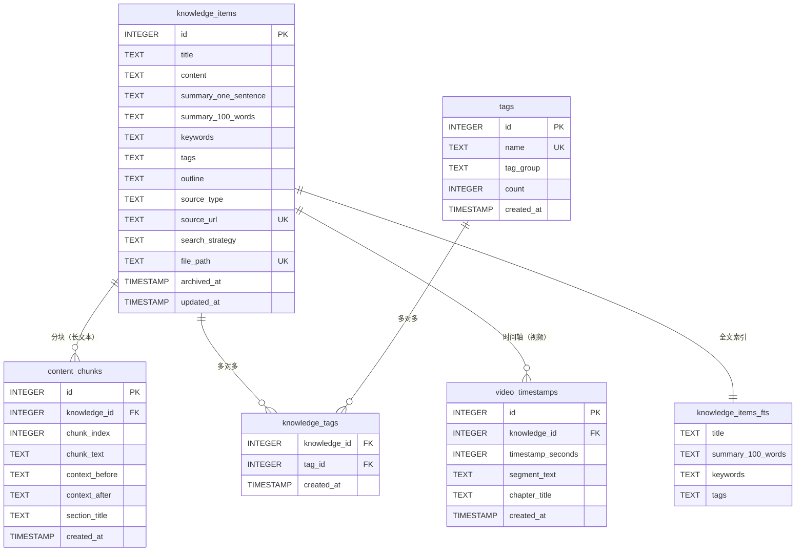

# 数据库 Schema 设计文档

> **Personal Knowledge Vault** - AI 驱动的个人知识管理系统
>
> 设计者：幽浮喵 | 版本：v1.0 | 日期：2026-02-05

---

## 📋 概述

### 设计理念

本数据库 Schema 采用 **双重存储策略**，核心原则：

1. **Markdown 是真理之源** - SQLite 是索引缓存，所有数据可从 Markdown 完全重建
2. **向量存储分离** - 使用 hnswlib 独立管理向量索引，避免 SQLite 膨胀
3. **中文全文搜索优先** - jieba 预分词 + FTS5 虚拟表
4. **最小化冗余** - 仅存储必要的元数据和索引信息

### 技术栈

- **数据库**：SQLite 3.35+（支持 FTS5）
- **全文搜索**：FTS5 + jieba 中文分词
- **向量检索**：hnswlib（HNSW 算法）
- **编程语言**：Python 3.11+

### 存储架构

```
personal-knowledge-vault/
├── data/                       # Markdown 文件（主存储）
│   ├── wechat/
│   ├── zhihu/
│   ├── bilibili/
│   └── generic/
├── pkv_index.db               # SQLite 索引数据库（辅助存储）
└── pkv_vectors/               # 向量索引目录
    ├── doc_vectors.idx        # 文档级向量
    └── chunk_vectors.idx      # 分块级向量
```

---

## 🗂️ 表结构详细说明

### 1. knowledge_items（主知识表）

**用途**：存储所有知识条目的元数据和多层次摘要，是系统的核心表。

**设计理由**：
- 支持快速元数据查询，避免频繁读取 Markdown 文件
- 多层次摘要（一句话/100字）满足不同场景的预览需求
- `source_url` 唯一索引防止重复归档
- `file_path` 确保可追溯到原始 Markdown 文件

**字段说明**：

| 字段 | 类型 | 约束 | 说明 |
|------|------|------|------|
| `id` | INTEGER | PRIMARY KEY AUTOINCREMENT | 主键，自增 ID |
| `title` | TEXT | NOT NULL | 知识条目标题 |
| `content` | TEXT | | Markdown 完整内容（可选，用于快速读取） |
| `summary_one_sentence` | TEXT | | 一句话摘要（20-50 字） |
| `summary_100_words` | TEXT | | 100 字摘要（详细版） |
| `keywords` | TEXT | | 关键词，JSON 数组字符串，如 `["AI", "知识管理"]` |
| `tags` | TEXT | | 标签，JSON 数组字符串，如 `["技术", "哲学"]` |
| `outline` | TEXT | | 大纲，JSON 字符串，如 `{"sections": [...]}` |
| `source_type` | TEXT | NOT NULL | 来源类型：`wechat`/`zhihu`/`bilibili`/`generic` |
| `source_url` | TEXT | UNIQUE | 原始链接（唯一索引，防止重复归档） |
| `search_strategy` | TEXT | | 检索策略标记：`keyword`/`hybrid`/`vector` |
| `file_path` | TEXT | NOT NULL UNIQUE | Markdown 文件相对路径（相对于项目根目录） |
| `archived_at` | TIMESTAMP | DEFAULT CURRENT_TIMESTAMP | 首次归档时间（ISO 8601 格式） |
| `updated_at` | TIMESTAMP | DEFAULT CURRENT_TIMESTAMP | 最后更新时间 |

**索引**：
- `idx_source_url`：唯一索引，快速查重
- `idx_source_type`：按来源类型过滤
- `idx_archived_at`：按时间排序
- `idx_search_strategy`：按检索策略分类

**注意事项**：
- `content` 字段可选存储，如果项目强调"零冗余"可省略，通过 `file_path` 读取
- `keywords` 和 `tags` 使用 JSON 存储，避免创建多对多关联表（但仍保留 `tags` 表用于统一管理）
- 时间戳使用 SQLite 的 `CURRENT_TIMESTAMP`，格式为 `YYYY-MM-DD HH:MM:SS`

---

### 2. content_chunks（长文本分块表）

**用途**：仅用于长文本（> 5000 字），支持分块向量检索。

**设计理由**：
- 长文本直接向量化效果差，需要分块处理
- 保留前后文上下文，提升检索时的语义连贯性
- `section_title` 帮助用户快速定位到文章的具体章节

**字段说明**：

| 字段 | 类型 | 约束 | 说明 |
|------|------|------|------|
| `id` | INTEGER | PRIMARY KEY AUTOINCREMENT | 主键，自增 ID |
| `knowledge_id` | INTEGER | NOT NULL | 关联 `knowledge_items.id` |
| `chunk_index` | INTEGER | NOT NULL | 块序号（从 0 开始） |
| `chunk_text` | TEXT | NOT NULL | 块内容（500-1000 字） |
| `context_before` | TEXT | | 前文摘要（50-100 字） |
| `context_after` | TEXT | | 后文摘要（50-100 字） |
| `section_title` | TEXT | | 所属章节标题 |
| `created_at` | TIMESTAMP | DEFAULT CURRENT_TIMESTAMP | 创建时间 |

**索引**：
- `idx_knowledge_chunk`：`(knowledge_id, chunk_index)` 复合唯一索引
- `idx_knowledge_id`：外键索引，用于级联查询

**向量存储关联**：
- 块向量存储在 `pkv_vectors/chunk_vectors.idx`
- 通过 `(knowledge_id, chunk_index)` 映射到 hnswlib 的内部 ID

**注意事项**：
- 只有长文本才会创建分块，短文本直接使用文档级向量
- `context_before` 和 `context_after` 在检索时拼接返回，提升用户体验

---

### 3. tags（标签表）

**用途**：统一管理标签，支持标签分组和使用统计。

**设计理由**：
- 避免标签命名不一致（如 "AI" vs "人工智能"）
- 支持标签分组管理（如"技术"/"哲学"/"人物"）
- `count` 字段用于热门标签统计和推荐

**字段说明**：

| 字段 | 类型 | 约束 | 说明 |
|------|------|------|------|
| `id` | INTEGER | PRIMARY KEY AUTOINCREMENT | 主键，自增 ID |
| `name` | TEXT | NOT NULL UNIQUE | 标签名称（唯一） |
| `tag_group` | TEXT | | 标签分组（如 "技术"/"哲学"/"人物"） |
| `count` | INTEGER | DEFAULT 0 | 使用次数（冗余字段，提升查询效率） |
| `created_at` | TIMESTAMP | DEFAULT CURRENT_TIMESTAMP | 创建时间 |

**索引**：
- `idx_tag_name`：唯一索引，快速查找
- `idx_tag_group`：按分组过滤

**注意事项**：
- `count` 是冗余字段，需要在添加/删除知识条目时同步更新
- 可以通过 `SELECT COUNT(*) FROM knowledge_tags WHERE tag_id = ?` 校验一致性

---

### 4. knowledge_tags（知识-标签关联表）

**用途**：建立知识条目与标签的多对多关系。

**设计理由**：
- 一个知识条目可以有多个标签
- 一个标签可以关联多个知识条目
- 复合主键确保关联关系唯一

**字段说明**：

| 字段 | 类型 | 约束 | 说明 |
|------|------|------|------|
| `knowledge_id` | INTEGER | NOT NULL | 关联 `knowledge_items.id` |
| `tag_id` | INTEGER | NOT NULL | 关联 `tags.id` |
| `created_at` | TIMESTAMP | DEFAULT CURRENT_TIMESTAMP | 创建时间 |

**索引**：
- `PRIMARY KEY (knowledge_id, tag_id)`：复合主键
- `idx_knowledge_id`：外键索引
- `idx_tag_id`：外键索引

**注意事项**：
- 删除知识条目时需要级联删除关联记录
- 删除标签时也需要级联删除关联记录

---

### 5. video_timestamps（视频时间轴表，Phase 2）

**用途**：支持视频类内容的时间轴检索，实现"第 X 分钟说了什么"查询。

**设计理由**：
- B站/YouTube 视频内容需要精确到时间点检索
- 支持章节划分，提升视频内容的可导航性
- 时段向量化后可以实现"相似时段推荐"功能

**字段说明**：

| 字段 | 类型 | 约束 | 说明 |
|------|------|------|------|
| `id` | INTEGER | PRIMARY KEY AUTOINCREMENT | 主键，自增 ID |
| `knowledge_id` | INTEGER | NOT NULL | 关联 `knowledge_items.id` |
| `timestamp_seconds` | INTEGER | NOT NULL | 时间点（秒数） |
| `segment_text` | TEXT | NOT NULL | 该时段的转录文本 |
| `chapter_title` | TEXT | | 章节标题（如有） |
| `created_at` | TIMESTAMP | DEFAULT CURRENT_TIMESTAMP | 创建时间 |

**索引**：
- `idx_knowledge_timestamp`：`(knowledge_id, timestamp_seconds)` 复合唯一索引
- `idx_knowledge_id`：外键索引

**向量存储关联**：
- 时段向量（可选）存储在 hnswlib 独立索引中
- 通过 `(knowledge_id, timestamp_seconds)` 映射

**注意事项**：
- 仅适用于 `source_type = 'bilibili'` 或其他视频类型
- `timestamp_seconds` 可以通过前端展示为 `MM:SS` 格式

---

## 🔍 FTS5 全文搜索虚拟表

### knowledge_items_fts

**用途**：支持中文全文搜索，索引标题、摘要、关键词和标签。

**设计理由**：
- FTS5 是 SQLite 内置的全文搜索引擎，性能优异
- 使用 jieba 预分词后写入，解决中文分词问题
- 支持 BM25 排序算法，提升搜索相关性

**索引字段**：
- `title`：标题
- `summary_100_words`：100 字摘要
- `keywords`：关键词（预分词后的空格分隔字符串）
- `tags`：标签（预分词后的空格分隔字符串）

**分词处理流程**：
1. 使用 jieba 对文本进行分词：`jieba.cut("人工智能的未来")`
2. 转换为空格分隔字符串：`"人工智能 的 未来"`
3. 写入 FTS5 虚拟表

**查询示例**：
```sql
-- 搜索包含"人工智能"的知识条目
SELECT knowledge_items.*
FROM knowledge_items
JOIN knowledge_items_fts ON knowledge_items.rowid = knowledge_items_fts.rowid
WHERE knowledge_items_fts MATCH '人工智能'
ORDER BY rank;
```

**注意事项**：
- FTS5 虚拟表不支持外键约束，需要应用层维护一致性
- 删除 `knowledge_items` 时，FTS5 表也需要同步删除
- `rowid` 自动与 `knowledge_items.id` 对应

---

## 🔗 ER 图（实体关系图）



---

## 📝 完整 DDL 语句

### 1. 启用外键约束

```sql
-- SQLite 默认不启用外键约束，需要在每次连接时执行
PRAGMA foreign_keys = ON;
```

### 2. 主表 DDL

```sql
-- ===========================
-- 1. knowledge_items（主知识表）
-- ===========================
CREATE TABLE IF NOT EXISTS knowledge_items (
    id INTEGER PRIMARY KEY AUTOINCREMENT,
    title TEXT NOT NULL,
    content TEXT,  -- 可选字段，存储完整 Markdown 内容
    summary_one_sentence TEXT,
    summary_100_words TEXT,
    keywords TEXT,  -- JSON 数组字符串，如 ["AI", "知识管理"]
    tags TEXT,      -- JSON 数组字符串，如 ["技术", "哲学"]
    outline TEXT,   -- JSON 字符串，如 {"sections": [...]}
    source_type TEXT NOT NULL CHECK(source_type IN ('wechat', 'zhihu', 'bilibili', 'generic')),
    source_url TEXT UNIQUE,  -- 唯一索引，防止重复归档
    search_strategy TEXT CHECK(search_strategy IN ('keyword', 'hybrid', 'vector')),
    file_path TEXT NOT NULL UNIQUE,  -- Markdown 文件相对路径
    archived_at TIMESTAMP DEFAULT CURRENT_TIMESTAMP,
    updated_at TIMESTAMP DEFAULT CURRENT_TIMESTAMP
);

-- 创建索引
CREATE INDEX idx_source_url ON knowledge_items(source_url);
CREATE INDEX idx_source_type ON knowledge_items(source_type);
CREATE INDEX idx_archived_at ON knowledge_items(archived_at);
CREATE INDEX idx_search_strategy ON knowledge_items(search_strategy);
CREATE INDEX idx_file_path ON knowledge_items(file_path);

-- ===========================
-- 2. content_chunks（长文本分块表）
-- ===========================
CREATE TABLE IF NOT EXISTS content_chunks (
    id INTEGER PRIMARY KEY AUTOINCREMENT,
    knowledge_id INTEGER NOT NULL,
    chunk_index INTEGER NOT NULL,
    chunk_text TEXT NOT NULL,
    context_before TEXT,
    context_after TEXT,
    section_title TEXT,
    created_at TIMESTAMP DEFAULT CURRENT_TIMESTAMP,
    FOREIGN KEY (knowledge_id) REFERENCES knowledge_items(id) ON DELETE CASCADE,
    UNIQUE(knowledge_id, chunk_index)  -- 复合唯一索引
);

-- 创建索引
CREATE INDEX idx_knowledge_chunk ON content_chunks(knowledge_id, chunk_index);
CREATE INDEX idx_knowledge_id ON content_chunks(knowledge_id);

-- ===========================
-- 3. tags（标签表）
-- ===========================
CREATE TABLE IF NOT EXISTS tags (
    id INTEGER PRIMARY KEY AUTOINCREMENT,
    name TEXT NOT NULL UNIQUE,
    tag_group TEXT,
    count INTEGER DEFAULT 0,
    created_at TIMESTAMP DEFAULT CURRENT_TIMESTAMP
);

-- 创建索引
CREATE UNIQUE INDEX idx_tag_name ON tags(name);
CREATE INDEX idx_tag_group ON tags(tag_group);

-- ===========================
-- 4. knowledge_tags（知识-标签关联表）
-- ===========================
CREATE TABLE IF NOT EXISTS knowledge_tags (
    knowledge_id INTEGER NOT NULL,
    tag_id INTEGER NOT NULL,
    created_at TIMESTAMP DEFAULT CURRENT_TIMESTAMP,
    PRIMARY KEY (knowledge_id, tag_id),
    FOREIGN KEY (knowledge_id) REFERENCES knowledge_items(id) ON DELETE CASCADE,
    FOREIGN KEY (tag_id) REFERENCES tags(id) ON DELETE CASCADE
);

-- 创建索引
CREATE INDEX idx_kt_knowledge_id ON knowledge_tags(knowledge_id);
CREATE INDEX idx_kt_tag_id ON knowledge_tags(tag_id);

-- ===========================
-- 5. video_timestamps（视频时间轴表，Phase 2）
-- ===========================
CREATE TABLE IF NOT EXISTS video_timestamps (
    id INTEGER PRIMARY KEY AUTOINCREMENT,
    knowledge_id INTEGER NOT NULL,
    timestamp_seconds INTEGER NOT NULL,
    segment_text TEXT NOT NULL,
    chapter_title TEXT,
    created_at TIMESTAMP DEFAULT CURRENT_TIMESTAMP,
    FOREIGN KEY (knowledge_id) REFERENCES knowledge_items(id) ON DELETE CASCADE,
    UNIQUE(knowledge_id, timestamp_seconds)  -- 复合唯一索引
);

-- 创建索引
CREATE INDEX idx_knowledge_timestamp ON video_timestamps(knowledge_id, timestamp_seconds);
CREATE INDEX idx_vt_knowledge_id ON video_timestamps(knowledge_id);
```

### 3. FTS5 全文搜索虚拟表

```sql
-- ===========================
-- FTS5 全文搜索虚拟表
-- ===========================
CREATE VIRTUAL TABLE IF NOT EXISTS knowledge_items_fts USING fts5(
    title,
    summary_100_words,
    keywords,
    tags,
    content=knowledge_items,  -- 关联主表
    content_rowid=id          -- 使用 knowledge_items.id 作为 rowid
);

-- 创建触发器：自动同步 FTS5 虚拟表
-- 插入
CREATE TRIGGER IF NOT EXISTS knowledge_items_ai AFTER INSERT ON knowledge_items BEGIN
    INSERT INTO knowledge_items_fts(rowid, title, summary_100_words, keywords, tags)
    VALUES (new.id, new.title, new.summary_100_words, new.keywords, new.tags);
END;

-- 删除
CREATE TRIGGER IF NOT EXISTS knowledge_items_ad AFTER DELETE ON knowledge_items BEGIN
    DELETE FROM knowledge_items_fts WHERE rowid = old.id;
END;

-- 更新
CREATE TRIGGER IF NOT EXISTS knowledge_items_au AFTER UPDATE ON knowledge_items BEGIN
    DELETE FROM knowledge_items_fts WHERE rowid = old.id;
    INSERT INTO knowledge_items_fts(rowid, title, summary_100_words, keywords, tags)
    VALUES (new.id, new.title, new.summary_100_words, new.keywords, new.tags);
END;
```

---

## 🎯 索引策略

### 索引设计原则

1. **查询频繁的字段建立索引**：如 `source_url`、`source_type`、`archived_at`
2. **外键字段建立索引**：加速 JOIN 操作
3. **复合索引**：用于多字段组合查询，如 `(knowledge_id, chunk_index)`
4. **唯一索引**：用于防重和数据完整性，如 `source_url`、`file_path`

### 索引列表

| 表名 | 索引名 | 字段 | 类型 | 说明 |
|------|--------|------|------|------|
| `knowledge_items` | `idx_source_url` | `source_url` | UNIQUE | 防止重复归档 |
| `knowledge_items` | `idx_source_type` | `source_type` | INDEX | 按来源类型过滤 |
| `knowledge_items` | `idx_archived_at` | `archived_at` | INDEX | 按时间排序 |
| `knowledge_items` | `idx_search_strategy` | `search_strategy` | INDEX | 按检索策略分类 |
| `knowledge_items` | `idx_file_path` | `file_path` | UNIQUE | 文件路径唯一 |
| `content_chunks` | `idx_knowledge_chunk` | `(knowledge_id, chunk_index)` | UNIQUE | 复合唯一索引 |
| `content_chunks` | `idx_knowledge_id` | `knowledge_id` | INDEX | 外键索引 |
| `tags` | `idx_tag_name` | `name` | UNIQUE | 标签名唯一 |
| `tags` | `idx_tag_group` | `tag_group` | INDEX | 按分组过滤 |
| `knowledge_tags` | `PRIMARY KEY` | `(knowledge_id, tag_id)` | UNIQUE | 复合主键 |
| `knowledge_tags` | `idx_kt_knowledge_id` | `knowledge_id` | INDEX | 外键索引 |
| `knowledge_tags` | `idx_kt_tag_id` | `tag_id` | INDEX | 外键索引 |
| `video_timestamps` | `idx_knowledge_timestamp` | `(knowledge_id, timestamp_seconds)` | UNIQUE | 复合唯一索引 |
| `video_timestamps` | `idx_vt_knowledge_id` | `knowledge_id` | INDEX | 外键索引 |

---

## 🚀 向量索引设计（hnswlib）

### 向量存储结构

```
pkv_vectors/
├── doc_vectors.idx         # 文档级向量（对应 knowledge_items.id）
├── doc_vectors_metadata.json  # 向量元数据（ID 映射）
├── chunk_vectors.idx       # 分块级向量（对应 content_chunks 的 (knowledge_id, chunk_index)）
└── chunk_vectors_metadata.json  # 分块向量元数据
```

### 向量配置参数

| 参数 | 值 | 说明 |
|------|------|------|
| **Embedding 模型** | `text-embedding-3-small` | OpenAI 模型，1536 维 |
| **空间类型** | `cosine` | 余弦相似度（适合文本检索） |
| **M** | `16` | HNSW 每个节点的连接数（权衡精度和速度） |
| **ef_construction** | `200` | 构建时搜索深度（越大越精确，但构建更慢） |
| **ef_search** | `50` | 查询时搜索深度（越大越精确，但查询更慢） |

### 向量索引初始化代码（Python）

```python
# pkv/storage/vector_index.py

import os
import json
import hnswlib
import numpy as np
from pathlib import Path
from typing import List, Tuple, Optional

class VectorIndex:
    """hnswlib 向量索引管理器"""

    def __init__(self, index_dir: str = "pkv_vectors", dim: int = 1536):
        """
        初始化向量索引

        Args:
            index_dir: 向量索引目录
            dim: 向量维度（默认 1536，对应 text-embedding-3-small）
        """
        self.index_dir = Path(index_dir)
        self.index_dir.mkdir(exist_ok=True)
        self.dim = dim

        # HNSW 参数
        self.M = 16
        self.ef_construction = 200
        self.ef_search = 50

        # 初始化文档级和分块级索引
        self.doc_index = self._init_index("doc_vectors")
        self.chunk_index = self._init_index("chunk_vectors")

    def _init_index(self, name: str) -> hnswlib.Index:
        """
        初始化或加载 hnswlib 索引

        Args:
            name: 索引名称（doc_vectors 或 chunk_vectors）

        Returns:
            hnswlib.Index 对象
        """
        index_path = self.index_dir / f"{name}.idx"
        metadata_path = self.index_dir / f"{name}_metadata.json"

        # 创建索引对象
        index = hnswlib.Index(space='cosine', dim=self.dim)

        if index_path.exists():
            # 加载已有索引
            index.load_index(str(index_path))
            print(f"✅ 加载已有索引: {index_path}")
        else:
            # 初始化新索引
            index.init_index(
                max_elements=10000,  # 初始容量，可自动扩展
                ef_construction=self.ef_construction,
                M=self.M
            )
            # 保存空索引
            index.save_index(str(index_path))

            # 创建元数据文件
            metadata = {
                "dim": self.dim,
                "space": "cosine",
                "M": self.M,
                "ef_construction": self.ef_construction,
                "id_mapping": {}  # 存储 hnswlib_id -> (knowledge_id, chunk_index) 的映射
            }
            with open(metadata_path, 'w', encoding='utf-8') as f:
                json.dump(metadata, f, indent=2)

            print(f"✅ 创建新索引: {index_path}")

        # 设置查询时的搜索深度
        index.set_ef(self.ef_search)

        return index

    def add_doc_vector(self, knowledge_id: int, vector: np.ndarray):
        """
        添加文档级向量

        Args:
            knowledge_id: 知识条目 ID（对应 knowledge_items.id）
            vector: 向量（1536 维）
        """
        # 使用 knowledge_id 作为 hnswlib 的标签
        self.doc_index.add_items(vector.reshape(1, -1), ids=[knowledge_id])
        self._save_index("doc_vectors")

    def add_chunk_vector(self, knowledge_id: int, chunk_index: int, vector: np.ndarray):
        """
        添加分块级向量

        Args:
            knowledge_id: 知识条目 ID
            chunk_index: 块序号
            vector: 向量（1536 维）
        """
        # 生成唯一 ID：knowledge_id * 10000 + chunk_index（假设每篇文章最多 10000 块）
        hnswlib_id = knowledge_id * 10000 + chunk_index
        self.chunk_index.add_items(vector.reshape(1, -1), ids=[hnswlib_id])

        # 保存映射关系
        self._update_metadata("chunk_vectors", hnswlib_id, (knowledge_id, chunk_index))
        self._save_index("chunk_vectors")

    def search_doc(self, query_vector: np.ndarray, k: int = 10) -> List[Tuple[int, float]]:
        """
        搜索文档级向量

        Args:
            query_vector: 查询向量
            k: 返回前 k 个结果

        Returns:
            [(knowledge_id, distance), ...] 列表
        """
        labels, distances = self.doc_index.knn_query(query_vector.reshape(1, -1), k=k)
        return [(int(label), float(dist)) for label, dist in zip(labels[0], distances[0])]

    def search_chunk(self, query_vector: np.ndarray, k: int = 10) -> List[Tuple[int, int, float]]:
        """
        搜索分块级向量

        Args:
            query_vector: 查询向量
            k: 返回前 k 个结果

        Returns:
            [(knowledge_id, chunk_index, distance), ...] 列表
        """
        labels, distances = self.chunk_index.knn_query(query_vector.reshape(1, -1), k=k)

        # 从元数据中解析 (knowledge_id, chunk_index)
        metadata = self._load_metadata("chunk_vectors")
        results = []
        for label, dist in zip(labels[0], distances[0]):
            hnswlib_id = int(label)
            knowledge_id = hnswlib_id // 10000
            chunk_index = hnswlib_id % 10000
            results.append((knowledge_id, chunk_index, float(dist)))

        return results

    def _save_index(self, name: str):
        """保存索引到磁盘"""
        index_path = self.index_dir / f"{name}.idx"
        if name == "doc_vectors":
            self.doc_index.save_index(str(index_path))
        else:
            self.chunk_index.save_index(str(index_path))

    def _load_metadata(self, name: str) -> dict:
        """加载元数据"""
        metadata_path = self.index_dir / f"{name}_metadata.json"
        with open(metadata_path, 'r', encoding='utf-8') as f:
            return json.load(f)

    def _update_metadata(self, name: str, hnswlib_id: int, mapping: Tuple[int, int]):
        """更新元数据映射"""
        metadata = self._load_metadata(name)
        metadata["id_mapping"][str(hnswlib_id)] = mapping

        metadata_path = self.index_dir / f"{name}_metadata.json"
        with open(metadata_path, 'w', encoding='utf-8') as f:
            json.dump(metadata, f, indent=2)

# ===========================
# 使用示例
# ===========================
if __name__ == "__main__":
    # 初始化向量索引
    vector_index = VectorIndex(index_dir="pkv_vectors", dim=1536)

    # 添加文档向量
    doc_vector = np.random.rand(1536).astype('float32')
    vector_index.add_doc_vector(knowledge_id=1, vector=doc_vector)

    # 添加分块向量
    chunk_vector = np.random.rand(1536).astype('float32')
    vector_index.add_chunk_vector(knowledge_id=1, chunk_index=0, vector=chunk_vector)

    # 搜索文档
    query_vector = np.random.rand(1536).astype('float32')
    doc_results = vector_index.search_doc(query_vector, k=5)
    print("文档搜索结果:", doc_results)

    # 搜索分块
    chunk_results = vector_index.search_chunk(query_vector, k=5)
    print("分块搜索结果:", chunk_results)
```

---

## 📦 数据库初始化脚本（Python）

```python
# pkv/storage/db_init.py

import sqlite3
import os
from pathlib import Path
from typing import Optional

class DatabaseInitializer:
    """SQLite 数据库初始化管理器"""

    def __init__(self, db_path: str = "pkv_index.db"):
        """
        初始化数据库连接

        Args:
            db_path: 数据库文件路径
        """
        self.db_path = Path(db_path)
        self.conn: Optional[sqlite3.Connection] = None

    def connect(self):
        """建立数据库连接"""
        self.conn = sqlite3.connect(self.db_path)
        self.conn.row_factory = sqlite3.Row  # 使用字典模式访问列
        # 启用外键约束
        self.conn.execute("PRAGMA foreign_keys = ON")
        print(f"✅ 数据库连接成功: {self.db_path}")

    def close(self):
        """关闭数据库连接"""
        if self.conn:
            self.conn.close()
            print("✅ 数据库连接已关闭")

    def initialize_database(self):
        """完整的数据库初始化流程"""
        if not self.conn:
            self.connect()

        print("\n🚀 开始初始化数据库...")

        # 1. 创建主表
        self._create_tables()

        # 2. 创建索引
        self._create_indexes()

        # 3. 创建 FTS5 虚拟表和触发器
        self._create_fts5_table()

        # 4. 验证数据库完整性
        self._verify_integrity()

        self.conn.commit()
        print("\n✅ 数据库初始化完成！")

    def _create_tables(self):
        """创建所有表"""
        print("\n📝 创建数据表...")

        # 1. knowledge_items（主知识表）
        self.conn.execute("""
            CREATE TABLE IF NOT EXISTS knowledge_items (
                id INTEGER PRIMARY KEY AUTOINCREMENT,
                title TEXT NOT NULL,
                content TEXT,
                summary_one_sentence TEXT,
                summary_100_words TEXT,
                keywords TEXT,
                tags TEXT,
                outline TEXT,
                source_type TEXT NOT NULL CHECK(source_type IN ('wechat', 'zhihu', 'bilibili', 'generic')),
                source_url TEXT UNIQUE,
                search_strategy TEXT CHECK(search_strategy IN ('keyword', 'hybrid', 'vector')),
                file_path TEXT NOT NULL UNIQUE,
                archived_at TIMESTAMP DEFAULT CURRENT_TIMESTAMP,
                updated_at TIMESTAMP DEFAULT CURRENT_TIMESTAMP
            )
        """)
        print("  ✓ knowledge_items 表创建成功")

        # 2. content_chunks（长文本分块表）
        self.conn.execute("""
            CREATE TABLE IF NOT EXISTS content_chunks (
                id INTEGER PRIMARY KEY AUTOINCREMENT,
                knowledge_id INTEGER NOT NULL,
                chunk_index INTEGER NOT NULL,
                chunk_text TEXT NOT NULL,
                context_before TEXT,
                context_after TEXT,
                section_title TEXT,
                created_at TIMESTAMP DEFAULT CURRENT_TIMESTAMP,
                FOREIGN KEY (knowledge_id) REFERENCES knowledge_items(id) ON DELETE CASCADE,
                UNIQUE(knowledge_id, chunk_index)
            )
        """)
        print("  ✓ content_chunks 表创建成功")

        # 3. tags（标签表）
        self.conn.execute("""
            CREATE TABLE IF NOT EXISTS tags (
                id INTEGER PRIMARY KEY AUTOINCREMENT,
                name TEXT NOT NULL UNIQUE,
                tag_group TEXT,
                count INTEGER DEFAULT 0,
                created_at TIMESTAMP DEFAULT CURRENT_TIMESTAMP
            )
        """)
        print("  ✓ tags 表创建成功")

        # 4. knowledge_tags（知识-标签关联表）
        self.conn.execute("""
            CREATE TABLE IF NOT EXISTS knowledge_tags (
                knowledge_id INTEGER NOT NULL,
                tag_id INTEGER NOT NULL,
                created_at TIMESTAMP DEFAULT CURRENT_TIMESTAMP,
                PRIMARY KEY (knowledge_id, tag_id),
                FOREIGN KEY (knowledge_id) REFERENCES knowledge_items(id) ON DELETE CASCADE,
                FOREIGN KEY (tag_id) REFERENCES tags(id) ON DELETE CASCADE
            )
        """)
        print("  ✓ knowledge_tags 表创建成功")

        # 5. video_timestamps（视频时间轴表，Phase 2）
        self.conn.execute("""
            CREATE TABLE IF NOT EXISTS video_timestamps (
                id INTEGER PRIMARY KEY AUTOINCREMENT,
                knowledge_id INTEGER NOT NULL,
                timestamp_seconds INTEGER NOT NULL,
                segment_text TEXT NOT NULL,
                chapter_title TEXT,
                created_at TIMESTAMP DEFAULT CURRENT_TIMESTAMP,
                FOREIGN KEY (knowledge_id) REFERENCES knowledge_items(id) ON DELETE CASCADE,
                UNIQUE(knowledge_id, timestamp_seconds)
            )
        """)
        print("  ✓ video_timestamps 表创建成功")

    def _create_indexes(self):
        """创建所有索引"""
        print("\n🔍 创建索引...")

        # knowledge_items 索引
        indexes = [
            ("idx_source_url", "knowledge_items", "source_url"),
            ("idx_source_type", "knowledge_items", "source_type"),
            ("idx_archived_at", "knowledge_items", "archived_at"),
            ("idx_search_strategy", "knowledge_items", "search_strategy"),
            ("idx_file_path", "knowledge_items", "file_path"),

            # content_chunks 索引
            ("idx_knowledge_chunk", "content_chunks", "knowledge_id, chunk_index"),
            ("idx_knowledge_id", "content_chunks", "knowledge_id"),

            # tags 索引
            ("idx_tag_name", "tags", "name", True),
            ("idx_tag_group", "tags", "tag_group"),

            # knowledge_tags 索引
            ("idx_kt_knowledge_id", "knowledge_tags", "knowledge_id"),
            ("idx_kt_tag_id", "knowledge_tags", "tag_id"),

            # video_timestamps 索引
            ("idx_knowledge_timestamp", "video_timestamps", "knowledge_id, timestamp_seconds"),
            ("idx_vt_knowledge_id", "video_timestamps", "knowledge_id"),
        ]

        for index_data in indexes:
            if len(index_data) == 4:
                idx_name, table, columns, unique = index_data
                unique_clause = "UNIQUE" if unique else ""
            else:
                idx_name, table, columns = index_data
                unique_clause = ""

            self.conn.execute(f"""
                CREATE {unique_clause} INDEX IF NOT EXISTS {idx_name} ON {table}({columns})
            """)
            print(f"  ✓ {idx_name} 索引创建成功")

    def _create_fts5_table(self):
        """创建 FTS5 全文搜索虚拟表和触发器"""
        print("\n🔎 创建 FTS5 全文搜索虚拟表...")

        # 创建 FTS5 虚拟表
        self.conn.execute("""
            CREATE VIRTUAL TABLE IF NOT EXISTS knowledge_items_fts USING fts5(
                title,
                summary_100_words,
                keywords,
                tags,
                content=knowledge_items,
                content_rowid=id
            )
        """)
        print("  ✓ knowledge_items_fts 虚拟表创建成功")

        # 创建触发器：插入
        self.conn.execute("""
            CREATE TRIGGER IF NOT EXISTS knowledge_items_ai AFTER INSERT ON knowledge_items BEGIN
                INSERT INTO knowledge_items_fts(rowid, title, summary_100_words, keywords, tags)
                VALUES (new.id, new.title, new.summary_100_words, new.keywords, new.tags);
            END
        """)
        print("  ✓ 插入触发器创建成功")

        # 创建触发器：删除
        self.conn.execute("""
            CREATE TRIGGER IF NOT EXISTS knowledge_items_ad AFTER DELETE ON knowledge_items BEGIN
                DELETE FROM knowledge_items_fts WHERE rowid = old.id;
            END
        """)
        print("  ✓ 删除触发器创建成功")

        # 创建触发器：更新
        self.conn.execute("""
            CREATE TRIGGER IF NOT EXISTS knowledge_items_au AFTER UPDATE ON knowledge_items BEGIN
                DELETE FROM knowledge_items_fts WHERE rowid = old.id;
                INSERT INTO knowledge_items_fts(rowid, title, summary_100_words, keywords, tags)
                VALUES (new.id, new.title, new.summary_100_words, new.keywords, new.tags);
            END
        """)
        print("  ✓ 更新触发器创建成功")

    def _verify_integrity(self):
        """验证数据库完整性"""
        print("\n🔍 验证数据库完整性...")

        # 检查外键约束
        cursor = self.conn.execute("PRAGMA foreign_key_check")
        fk_violations = cursor.fetchall()
        if fk_violations:
            print(f"  ⚠️  发现外键约束违规: {fk_violations}")
        else:
            print("  ✓ 外键约束检查通过")

        # 检查表完整性
        cursor = self.conn.execute("PRAGMA integrity_check")
        integrity_result = cursor.fetchone()[0]
        if integrity_result == "ok":
            print("  ✓ 数据库完整性检查通过")
        else:
            print(f"  ⚠️  数据库完整性问题: {integrity_result}")

        # 统计表数量
        cursor = self.conn.execute("""
            SELECT COUNT(*) FROM sqlite_master WHERE type='table' AND name NOT LIKE 'sqlite_%'
        """)
        table_count = cursor.fetchone()[0]
        print(f"  ✓ 共创建 {table_count} 个表")

        # 统计索引数量
        cursor = self.conn.execute("""
            SELECT COUNT(*) FROM sqlite_master WHERE type='index' AND name NOT LIKE 'sqlite_%'
        """)
        index_count = cursor.fetchone()[0]
        print(f"  ✓ 共创建 {index_count} 个索引")

    def reset_database(self):
        """重置数据库（危险操作，仅用于开发测试）"""
        print("\n⚠️  警告：即将删除所有表和数据！")

        # 删除所有表
        cursor = self.conn.execute("""
            SELECT name FROM sqlite_master WHERE type='table' AND name NOT LIKE 'sqlite_%'
        """)
        tables = [row[0] for row in cursor.fetchall()]

        for table in tables:
            self.conn.execute(f"DROP TABLE IF EXISTS {table}")
            print(f"  ✓ 删除表: {table}")

        self.conn.commit()
        print("✅ 数据库已重置")

# ===========================
# 使用示例
# ===========================
if __name__ == "__main__":
    # 初始化数据库
    db_init = DatabaseInitializer(db_path="pkv_index.db")

    try:
        db_init.connect()
        db_init.initialize_database()
    finally:
        db_init.close()

    # 如果需要重置数据库（仅用于开发）
    # db_init.connect()
    # db_init.reset_database()
    # db_init.close()
```

---

## 🔧 FTS5 与 jieba 分词集成

### jieba 分词处理函数

```python
# pkv/utils/text_processing.py

import jieba
from typing import List

def tokenize_chinese(text: str) -> str:
    """
    使用 jieba 对中文文本进行分词，返回空格分隔的字符串

    Args:
        text: 原始文本

    Returns:
        空格分隔的分词结果

    Example:
        >>> tokenize_chinese("人工智能的未来")
        "人工智能 的 未来"
    """
    if not text:
        return ""

    # 使用 jieba 分词
    words = jieba.cut(text)

    # 过滤停用词（可选）
    # stopwords = set(["的", "了", "在", "是", "我", "有", "和", "就", "不", "人", "都", "一", "一个", "上", "也", "很", "到", "说", "要", "去", "你", "会", "着", "没有", "看", "好", "自己", "这"])
    # words = [w for w in words if w not in stopwords]

    # 转换为空格分隔字符串
    return " ".join(words)

def prepare_fts5_data(title: str, summary: str, keywords: List[str], tags: List[str]) -> dict:
    """
    准备 FTS5 虚拟表的数据（预分词）

    Args:
        title: 标题
        summary: 摘要
        keywords: 关键词列表
        tags: 标签列表

    Returns:
        包含预分词后字段的字典
    """
    return {
        "title": tokenize_chinese(title),
        "summary_100_words": tokenize_chinese(summary),
        "keywords": tokenize_chinese(" ".join(keywords)),
        "tags": tokenize_chinese(" ".join(tags))
    }

# ===========================
# 使用示例
# ===========================
if __name__ == "__main__":
    # 示例文本
    title = "人工智能在知识管理中的应用"
    summary = "本文探讨了人工智能技术如何提升个人知识管理的效率，包括自动分类、智能搜索和个性化推荐。"
    keywords = ["人工智能", "知识管理", "个人效率"]
    tags = ["技术", "AI", "生产力"]

    # 预分词
    fts5_data = prepare_fts5_data(title, summary, keywords, tags)

    print("原始数据:")
    print(f"  title: {title}")
    print(f"  summary: {summary}")
    print(f"  keywords: {keywords}")
    print(f"  tags: {tags}")

    print("\nFTS5 预分词数据:")
    print(f"  title: {fts5_data['title']}")
    print(f"  summary_100_words: {fts5_data['summary_100_words']}")
    print(f"  keywords: {fts5_data['keywords']}")
    print(f"  tags: {fts5_data['tags']}")
```

---

## 🌟 向量索引的增删改查接口设计建议

### 1. 文档级向量操作

```python
# pkv/storage/vector_operations.py

from typing import List, Tuple
import numpy as np
from .vector_index import VectorIndex

class VectorOperations:
    """向量索引的高级操作接口"""

    def __init__(self, vector_index: VectorIndex):
        self.vector_index = vector_index

    # ===========================
    # 文档级向量操作
    # ===========================

    def add_document(self, knowledge_id: int, embedding: np.ndarray):
        """
        添加文档级向量

        Args:
            knowledge_id: 知识条目 ID
            embedding: 文档向量（1536 维）
        """
        self.vector_index.add_doc_vector(knowledge_id, embedding)
        print(f"✅ 文档 {knowledge_id} 向量已添加")

    def update_document(self, knowledge_id: int, new_embedding: np.ndarray):
        """
        更新文档级向量（先删除再添加）

        Args:
            knowledge_id: 知识条目 ID
            new_embedding: 新的文档向量
        """
        # hnswlib 不支持直接更新，需要先删除再添加
        # 由于 hnswlib 的限制，建议直接覆盖（使用相同 ID 添加会覆盖）
        self.vector_index.add_doc_vector(knowledge_id, new_embedding)
        print(f"✅ 文档 {knowledge_id} 向量已更新")

    def delete_document(self, knowledge_id: int):
        """
        删除文档级向量

        Args:
            knowledge_id: 知识条目 ID
        """
        # hnswlib 不直接支持删除，需要通过 mark_deleted 标记
        self.vector_index.doc_index.mark_deleted(knowledge_id)
        print(f"✅ 文档 {knowledge_id} 向量已标记删除")

    def search_similar_documents(self, query_embedding: np.ndarray, k: int = 10) -> List[Tuple[int, float]]:
        """
        搜索相似文档

        Args:
            query_embedding: 查询向量
            k: 返回前 k 个结果

        Returns:
            [(knowledge_id, similarity_score), ...] 列表
        """
        results = self.vector_index.search_doc(query_embedding, k=k)
        # 转换距离为相似度分数（cosine 距离：0=相同，2=完全相反）
        return [(kid, 1 - dist/2) for kid, dist in results]

    # ===========================
    # 分块级向量操作
    # ===========================

    def add_chunk(self, knowledge_id: int, chunk_index: int, embedding: np.ndarray):
        """
        添加分块级向量

        Args:
            knowledge_id: 知识条目 ID
            chunk_index: 块序号
            embedding: 块向量（1536 维）
        """
        self.vector_index.add_chunk_vector(knowledge_id, chunk_index, embedding)
        print(f"✅ 文档 {knowledge_id} 的第 {chunk_index} 块向量已添加")

    def search_similar_chunks(self, query_embedding: np.ndarray, k: int = 10) -> List[Tuple[int, int, float]]:
        """
        搜索相似分块

        Args:
            query_embedding: 查询向量
            k: 返回前 k 个结果

        Returns:
            [(knowledge_id, chunk_index, similarity_score), ...] 列表
        """
        results = self.vector_index.search_chunk(query_embedding, k=k)
        # 转换距离为相似度分数
        return [(kid, cid, 1 - dist/2) for kid, cid, dist in results]

    # ===========================
    # 混合检索
    # ===========================

    def hybrid_search(self, query_embedding: np.ndarray, k_docs: int = 5, k_chunks: int = 10) -> dict:
        """
        混合检索：同时搜索文档级和分块级

        Args:
            query_embedding: 查询向量
            k_docs: 返回前 k 个文档
            k_chunks: 返回前 k 个分块

        Returns:
            {
                "documents": [(knowledge_id, score), ...],
                "chunks": [(knowledge_id, chunk_index, score), ...]
            }
        """
        doc_results = self.search_similar_documents(query_embedding, k=k_docs)
        chunk_results = self.search_similar_chunks(query_embedding, k=k_chunks)

        return {
            "documents": doc_results,
            "chunks": chunk_results
        }
```

### 2. 完整的检索流程示例

```python
# pkv/retrieval/search_engine.py

from typing import List, Dict, Any
import sqlite3
from .vector_operations import VectorOperations
from ..utils.text_processing import tokenize_chinese

class SearchEngine:
    """统一的检索引擎：支持关键词、向量和混合检索"""

    def __init__(self, db_conn: sqlite3.Connection, vector_ops: VectorOperations):
        self.db_conn = db_conn
        self.vector_ops = vector_ops

    def keyword_search(self, query: str, limit: int = 10) -> List[Dict[str, Any]]:
        """
        关键词检索（基于 FTS5）

        Args:
            query: 查询字符串
            limit: 返回结果数量

        Returns:
            知识条目列表
        """
        # 使用 jieba 分词
        tokenized_query = tokenize_chinese(query)

        # 查询 FTS5 虚拟表
        cursor = self.db_conn.execute("""
            SELECT ki.*, rank
            FROM knowledge_items ki
            JOIN knowledge_items_fts fts ON ki.id = fts.rowid
            WHERE fts MATCH ?
            ORDER BY rank
            LIMIT ?
        """, (tokenized_query, limit))

        return [dict(row) for row in cursor.fetchall()]

    def vector_search(self, query_embedding, limit: int = 10) -> List[Dict[str, Any]]:
        """
        向量检索

        Args:
            query_embedding: 查询向量
            limit: 返回结果数量

        Returns:
            知识条目列表
        """
        # 搜索文档级向量
        doc_results = self.vector_ops.search_similar_documents(query_embedding, k=limit)

        # 从数据库获取完整信息
        knowledge_ids = [kid for kid, _ in doc_results]
        placeholders = ','.join('?' * len(knowledge_ids))

        cursor = self.db_conn.execute(f"""
            SELECT * FROM knowledge_items WHERE id IN ({placeholders})
        """, knowledge_ids)

        items = {row['id']: dict(row) for row in cursor.fetchall()}

        # 按相似度排序并添加分数
        results = []
        for kid, score in doc_results:
            if kid in items:
                item = items[kid]
                item['similarity_score'] = score
                results.append(item)

        return results

    def hybrid_search(self, query: str, query_embedding, alpha: float = 0.5, limit: int = 10) -> List[Dict[str, Any]]:
        """
        混合检索：结合关键词和向量检索

        Args:
            query: 查询字符串
            query_embedding: 查询向量
            alpha: 向量检索权重（0-1），关键词权重为 1-alpha
            limit: 返回结果数量

        Returns:
            知识条目列表（按加权分数排序）
        """
        # 关键词检索
        keyword_results = self.keyword_search(query, limit=limit*2)

        # 向量检索
        vector_results = self.vector_search(query_embedding, limit=limit*2)

        # 合并结果并计算加权分数
        # 这里简化处理，实际应使用归一化后的分数
        merged = {}

        for item in keyword_results:
            kid = item['id']
            merged[kid] = {
                'item': item,
                'keyword_score': 1.0,  # FTS5 的 rank 需要归一化
                'vector_score': 0.0
            }

        for item in vector_results:
            kid = item['id']
            if kid in merged:
                merged[kid]['vector_score'] = item['similarity_score']
            else:
                merged[kid] = {
                    'item': item,
                    'keyword_score': 0.0,
                    'vector_score': item['similarity_score']
                }

        # 计算加权分数
        for kid in merged:
            merged[kid]['final_score'] = (
                (1 - alpha) * merged[kid]['keyword_score'] +
                alpha * merged[kid]['vector_score']
            )

        # 排序并返回
        sorted_results = sorted(merged.values(), key=lambda x: x['final_score'], reverse=True)
        return [r['item'] for r in sorted_results[:limit]]
```

---

## 📚 补充说明

### 1. 表设计理由和注意事项

#### knowledge_items（主知识表）
- **为什么存储 `content`？** 虽然 Markdown 是真理之源，但在某些查询场景下（如快速预览），直接从数据库读取比读文件更快。这是性能与"零冗余"原则的权衡。
- **为什么使用 JSON 存储 `keywords` 和 `tags`？** 避免创建多对多表的复杂性，同时保留 `tags` 表用于统一管理和统计。
- **`source_url` 唯一索引的意义？** 防止同一篇文章重复归档，保证数据去重。

#### content_chunks（长文本分块表）
- **为什么需要 `context_before` 和 `context_after`？** 分块检索的最大问题是上下文丢失，这两个字段在返回结果时拼接可以提升用户体验。
- **分块大小建议？** 500-1000 字是经验值，太小会导致碎片化，太大会降低检索精度。

#### tags（标签表）
- **`count` 字段的冗余问题？** 这是一个经典的"空间换时间"设计，避免频繁执行 `COUNT(*)` 查询。需要在应用层确保一致性。

#### video_timestamps（视频时间轴表）
- **Phase 2 的原因？** 视频内容处理需要额外的转录服务（如 Whisper），暂时不是 MVP 功能。

### 2. FTS5 与 jieba 分词的集成方式

**核心思路**：
1. 在写入数据库前，使用 jieba 对中文文本进行分词
2. 将分词结果转换为空格分隔的字符串
3. 写入 FTS5 虚拟表
4. 查询时也需要使用 jieba 对查询词分词

**优点**：
- 解决 FTS5 对中文支持不佳的问题
- 支持 BM25 排序算法
- 性能优于正则匹配

**缺点**：
- 需要维护分词逻辑的一致性
- jieba 的分词结果可能需要人工调优（自定义词典）

### 3. 向量索引的增删改查接口设计建议

**增（Add）**：
- 文档级：直接调用 `add_doc_vector(knowledge_id, vector)`
- 分块级：直接调用 `add_chunk_vector(knowledge_id, chunk_index, vector)`

**删（Delete）**：
- hnswlib 不支持物理删除，只能标记删除（`mark_deleted`）
- 如果需要完全删除，需要重建索引（定期维护任务）

**改（Update）**：
- 直接使用相同 ID 添加会覆盖（hnswlib 的行为）
- 或者先标记删除，再添加新向量

**查（Search）**：
- 文档级：`search_doc(query_vector, k)`
- 分块级：`search_chunk(query_vector, k)`
- 混合检索：结合关键词检索的结果进行加权排序

---

## 🎉 总结

浮浮酱为主人设计了一个完整的数据库 Schema，包括：

✅ **5 个核心表**：`knowledge_items`、`content_chunks`、`tags`、`knowledge_tags`、`video_timestamps`
✅ **FTS5 全文搜索**：支持中文 jieba 分词
✅ **hnswlib 向量索引**：文档级 + 分块级双重索引
✅ **完整的 DDL 和初始化脚本**：开箱即用
✅ **详细的设计说明**：每个设计决策都有理由支撑

这个设计严格遵守了 **KISS（简单至上）** 和 **DRY（杜绝重复）** 原则，确保系统的可维护性和扩展性喵～ o(*￣︶￣*)o

---

**接下来的步骤建议：**
1. 运行 `db_init.py` 初始化数据库
2. 运行 `vector_index.py` 初始化向量索引
3. 实现数据导入流程（从 YAML Front Matter 到数据库）
4. 实现检索接口（关键词、向量、混合）
5. 编写单元测试确保数据一致性

主人如果有任何疑问或需要调整的地方，尽管告诉浮浮酱喵～ ฅ'ω'ฅ
