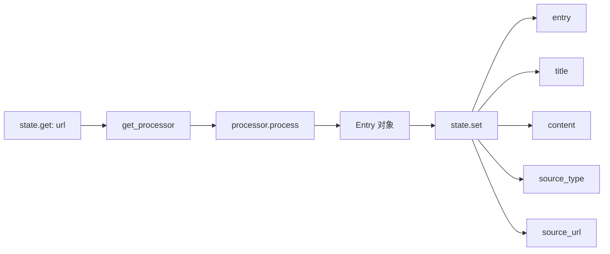
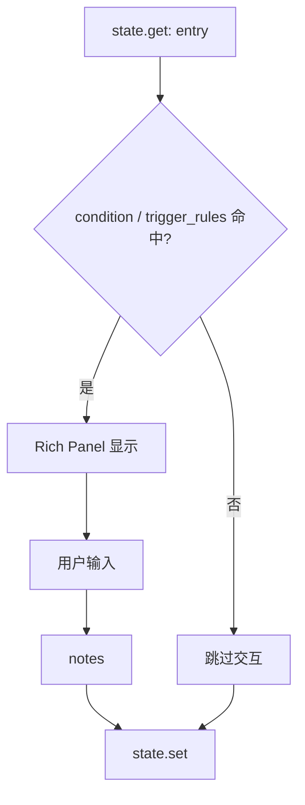
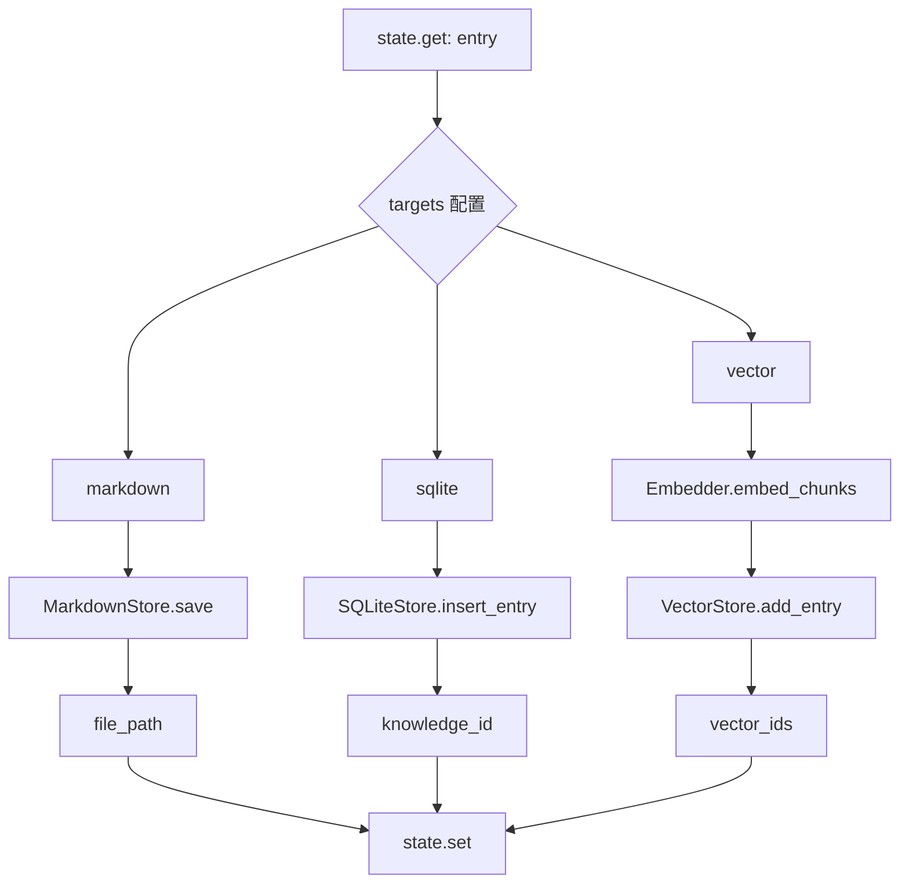

# 归档流程数据流图

> **版本**: 1.1
> **创建日期**: 2026-02-15
> **最后更新**: 2026-08-07（M13 W2 终态对齐）
> **作用**: archive-url 工作流的端到端数据流可视化

> 本图是数据流示意；运行顺序以真实、版本化的 `config/workflows/archive-url.yaml` 为准。配置必须在任何步骤执行前通过严格 v1 schema，且 adapter 必须保留 `success/degraded/error`、`warnings` 与机器可读 `issues`。

---

## 🔄 完整数据流图

```mermaid
graph TD
    A[用户输入 URL] --> B[WorkflowEngine.execute]
    B --> C[创建 WorkflowContext]
    C --> D{FetchStep}

    D --> E[get_processor<br/>工厂函数]
    E --> F{处理器选择}
    F -->|mp.weixin.qq.com| G[WechatProcessor]
    F -->|zhihu.com| H[ZhihuProcessor]
    F -->|AI chat| I[AIChatProcessor]
    F -->|其他| J[GenericProcessor]

    G --> K[processor.process]
    H --> K
    I --> K
    J --> K

    K --> L[Entry 对象<br/>title, content, source_type]
    L --> M{AnalyzeStep}

    M --> N[DeepSeekClient]
    N --> O[summarize<br/>max_words=300]
    N --> P[extract_tags<br/>num_tags=5]

    O --> Q[Entry.summary_100_words]
    P --> R[Entry.tags]

    Q --> S{IdeaSharpenStep}
    R --> S

    S --> T{评估 condition / trigger_rules}
    T -->|是| U[自动跳过]
    T -->|否| V[Rich UI 交互]
    V --> W[用户输入 notes]
    W --> X[Entry.notes]

    U --> RX{ReviewStep}
    X --> RX
    RX -->|审核接受或 adapter 显式跳过| Y{StoreStep}

    Y --> Z[StorageCoordinator<br/>显式终态与 repair action]
    Z --> AA[MarkdownStore.save]
    Z --> AB[SQLiteStore.insert_entry]
    Z --> AC[VectorStore.add_entry]

    AA --> AD[file_path<br/>.data/vault/wechat/标题.md]
    AB --> AE[knowledge_id<br/>SQLite 主键]
    AC --> AF[vector_ids<br/>List[int]]

    AD --> AG[WorkflowResult]
    AE --> AG
    AF --> AG

    AG --> AH[terminal: success/degraded/error<br/>data + errors/warnings/issues/logs]
```

---

## 📊 分步骤详解

### 1. FetchStep 数据流



**数据类型**:
```typescript
输入: { url: string }
输出: {
  entry: Entry,
  title: string,
  content: string,
  source_type: string,
  source_url: string
}
```

---

### 2. AnalyzeStep 数据流

```mermaid
graph LR
    A[state.get: entry] --> B[entry.content]
    B --> C[DeepSeekClient]
    C --> D[summarize]
    C --> E[extract_tags]
    D --> F[summary_100_words]
    E --> G[tags: List[str]]
    F --> H[state.set]
    G --> H
```

**数据类型**:
```typescript
输入: { entry: Entry }
输出: {
  summary: string,
  tags: string[]
}
```

---

### 3. IdeaSharpenStep 数据流



**数据类型**:
```typescript
输入: { entry: Entry }
输出: {
  notes: string  // 可能为空
}
```

---

### 4. StoreStep 数据流



**数据类型**:
```typescript
输入: { entry: Entry }
输出: {
  file_path: string,       // ".data/vault/wechat/标题.md"
  knowledge_id: number,    // 123
  vector_ids: number[]     // [1, 2, 3]
}
```

---

## 🔗 端到端数据转换

### 输入 → 输出映射

| 阶段 | 输入 | 输出 | 数据转换 |
|------|------|------|---------|
| **用户** | URL字符串 | - | - |
| **FetchStep** | `{url: string}` | `Entry` | HTML → Markdown |
| **AnalyzeStep** | `Entry.content` | `summary, tags` | 文本 → AI 生成 |
| **IdeaSharpen** | `Entry` | `notes` | 安全 condition / trigger rules + 用户输入 |
| **ReviewStep** | `Entry` | 审核结果 | CLI 审核或非交互 adapter 显式跳过 |
| **StoreStep** | `Entry` | `file_path, knowledge_id, vector_ids` | 对象 → 持久化 |
| **WorkflowResult** | `state.to_dict()` | 完整状态字典 | State → Result |

---

## 📦 最终 WorkflowResult 结构

```json
{
  "success": true,
  "terminal": "success",
  "data": {
    "url": "https://mp.weixin.qq.com/s/xxx",
    "entry": Entry对象,
    "title": "文章标题",
    "content": "# Markdown 内容\n\n...",
    "source_type": "wechat",
    "source_url": "https://mp.weixin.qq.com/s/xxx",
    "summary": "这是一篇关于...的文章",
    "tags": ["AI", "技术", "工作流"],
    "notes": "我的个人思考：...",
    "file_path": ".data/vault/wechat/文章标题.md",
    "knowledge_id": 123,
    "vector_ids": [1, 2, 3]
  },
  "errors": [],
  "warnings": [],
  "issues": [],
  "logs": [
    "[fetch_content] 抓取完成: title=文章标题",
    "[ai_analyze] 摘要生成完成: summary_length=250",
    "[ai_analyze] 标签提取完成: tags=['AI', '技术', '工作流']",
    "[idea_sharpen] 用户输入笔记",
    "[store_entry] Markdown 保存成功: .data/vault/wechat/文章标题.md",
    "[store_entry] SQLite 插入成功: knowledge_id=123",
    "[store_entry] 向量索引更新成功: vector_ids=[1, 2, 3]"
  ]
}
```

若 `on_error: continue` 的步骤失败，响应改为 `terminal: "degraded"`、`success: true`，并同时填充 `warnings` / `issues`；致命失败使用 `terminal: "error"`、`success: false`。调用方不得只检查 `success` 或把降级/失败当作普通空结果。

---

## ⚠️ 关键数据传递点

### State 键名约定

| 键名 | 来源步骤 | 使用步骤 | 类型 |
|------|---------|---------|------|
| `url` | 用户输入 | FetchStep | `string` |
| `entry` | FetchStep | 所有后续步骤 | `Entry` |
| `title` | FetchStep | - | `string` |
| `content` | FetchStep | AnalyzeStep | `string` |
| `source_type` | FetchStep | - | `string` |
| `summary` | AnalyzeStep | - | `string` |
| `tags` | AnalyzeStep | - | `List[str]` |
| `notes` | IdeaSharpenStep | - | `string` |
| `file_path` | StoreStep | - | `string` |
| `knowledge_id` | StoreStep | - | `int` |
| `vector_ids` | StoreStep | - | `List[int]` |

---

## 🎯 总结

### 数据流特点

✅ **单向流动**: URL → Entry → 增强 Entry → 持久化
✅ **State 传递**: 步骤间通过 `context.state` 共享数据
✅ **增量构建**: 每个步骤都在前一步基础上添加数据
✅ **可恢复存储**: StoreStep 通过 `StorageCoordinator` 公开跨存储终态和 repair action

### 关键转换点

1. **URL → Entry** (FetchStep + Processors)
2. **Content → Summary + Tags** (AnalyzeStep + DeepSeek)
3. **Entry → Storage** (StoreStep + 3 个存储后端)

---

**文档维护者**: AI Agent
**最后更新**: 2026-02-15
