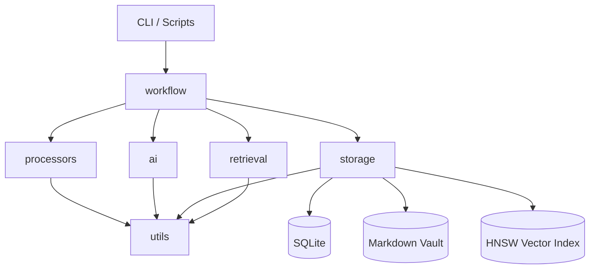

# 维护指南
> 项目: Personal Knowledge Vault (PKV)
> 适用版本: 0.6.x
> 最后更新: 2026-02-16
> 维护目标: 稳定、可恢复、可扩展、成本可控
---
## 目录
- 1. 系统架构
- 2. 日常维护
- 3. 性能监控
- 4. 扩展开发
---
## 1. 系统架构
### 1.1 架构概览
Personal Knowledge Vault 是一套 **工作流驱动 + 插件化处理 + 本地优先** 的知识归档系统。
核心链路是“输入 → 处理 → 分析 → 存储 → 检索”，并以 YAML 工作流配置驱动执行。
架构分层如下（从上到下）：
- 用户交互层：CLI / 脚本 / 直接调用 Python API
- 工作流编排层：`src/workflow/` 负责编排、状态与日志
- 处理与检索层：`src/processors/` + `src/retrieval/`
- AI 服务层：`src/ai/` 负责摘要、标签与向量化
- 存储层：`src/storage/` 负责 Markdown / SQLite / 向量索引
### 1.2 模块依赖关系图

依赖关系要点：
- `workflow` 是核心编排层，持有对 processors / ai / storage 的依赖。
- `retrieval` 依赖 `storage` 的 SQLite 与向量索引；但检索不依赖 processors。
- `utils` 为通用基础能力（日志、文本处理、配置读取）。
- 数据持久化以 `.data/` 目录为根，具体路径由 `config/config.yaml` 定义。
### 1.3 模块职责与关键文件
#### 1.3.1 workflow（工作流）
- 入口: `src/workflow/engine.py`
- 步骤基类: `src/workflow/steps.py::BaseStep`
- 数据模型: `src/workflow/models.py`（State / Context / Result）
关键职责：
- 加载 `config/workflows/*.yaml` 并规范化步骤配置
- 以 `WorkflowContext` 在步骤间传递状态
- 将步骤日志写入 `context.logs`
- 产出 `WorkflowResult`（success, data, errors, logs）
#### 1.3.2 processors（内容处理器）
- 入口: `src/processors/__init__.py`
- 基类: `src/processors/base.py::BaseProcessor`
- 处理器集合: Wechat / Zhihu / Chat / AIChat / TextFallback / Generic
关键职责：
- 根据 URL 或输入特征自动路由至对应处理器
- 将内容解析为统一的 `Entry` 数据类（见 `src/storage/markdown_store.py`）
- 输出标准字段：title / content / tags / summary / source_type 等
#### 1.3.3 storage（存储层）
- Markdown: `src/storage/markdown_store.py`
- SQLite: `src/storage/sqlite_store.py`
- Vector: `src/storage/vector_store.py`
三层存储逻辑：
- Markdown 为主存储（可读、可版本控制）
- SQLite 为元数据索引层（FTS5）
- 向量索引为语义检索层（hnswlib）
注意：当前实现中 Markdown 文件名由标题清洗后生成，并保存在 `.data/vault/<source_type>/` 子目录下（非按日期）。
#### 1.3.4 retrieval（检索）
- BM25: `src/retrieval/bm25_retriever.py`
- Vector: `src/retrieval/vector_retriever.py`
- Hybrid: `src/retrieval/hybrid_retriever.py`
- Router: `src/retrieval/query_router.py`
关键职责：
- 按查询长度与特征选择检索策略
- 输出统一 `SearchResult` 结构（knowledge_id / title / score 等）
#### 1.3.5 ai（AI 服务）
- DeepSeek: `src/ai/deepseek_client.py`（摘要/标签）
- OpenAI: `src/ai/openai_client.py`（Embedding）
- Embedder: `src/ai/embedder.py`（向量化封装）
关键职责：
- 统一 API 调用逻辑与重试
- 提供摘要、标签、向量化能力
- 控制成本（分块、缓存、降级策略）
#### 1.3.6 utils（工具层）
- 日志: `src/utils/logger.py`
- 文本处理: `src/utils/text_utils.py`
- 配置读取: `src/utils/config.py`
关键职责：
- 日志统一格式与轮转
- 中文分词与 FTS5 预处理
- 从 `.env` 与 `config/config.yaml` 读取配置
### 1.4 数据流与核心路径
#### 1.4.1 归档工作流数据流（简化）
该流程完整图见：`docs/refactor/归档流程数据流图.md`。
简化数据流如下：
```
输入 URL
  -> FetchStep (get_processor → Entry)
  -> AnalyzeStep (DeepSeek 摘要 + 标签)
  -> IdeaSharpenStep (可选交互)
  -> StoreStep (Markdown + SQLite + Vector)
  -> WorkflowResult
```
关键状态传递字段（常用）：
- url
- entry
- content
- summary / tags
- file_path
- knowledge_id
- vector_ids (在向量索引写入后可推导)
#### 1.4.2 检索工作流数据流（概念）
当前 `config/workflows/search.yaml` 描述了路由 → 检索 → 格式化的流程，但这些步骤类型尚未在 `_STEP_REGISTRY` 中实现。
如需使用，请实现对应 `BaseStep` 子类并注册。
#### 1.4.3 三层存储一致性
数据一致性原则：
- Markdown 是唯一“可逆”的事实来源
- SQLite 与 Vector 可随时重建
- 日常维护以 Markdown 完整性为第一优先级
### 1.5 关键设计决策
1. **工作流驱动**
   - 逻辑以 YAML 配置为准，便于调整步骤与策略。
   - `WorkflowEngine` 支持注册自定义步骤，降低扩展成本。
2. **三层存储**
   - 主存储与索引分离，确保数据可读性与检索效率兼得。
   - 允许在索引损坏时快速恢复。
3. **智能检索路由**
   - 短查询优先 BM25，长查询优先向量检索。
   - 降低 API 调用成本，避免无谓向量化。
4. **本地优先**
   - 数据存储与索引均在本地 `.data/`。
   - 数据可迁移、可备份、可删除，避免云锁定。
5. **可降级策略**
   - AI 服务失败时允许流程继续执行（配置 `on_error: continue`）。
   - 保障在网络不稳定时仍能归档核心内容。
### 1.6 运行时目录结构
默认目录配置见 `config/config.yaml`：
```
.data/
├── db/           # SQLite 数据库
├── logs/         # 日志文件
├── tmp/          # 临时文件
├── vault/        # Markdown 主存储
└── vectors/      # HNSW 向量索引
```
其中：
- `.data/db/knowledge_vault.db` 为 SQLite 主库
- `.data/logs/pkv.log` 为默认日志文件
- `.data/vectors/*.idx` 为向量索引文件
- `.data/vault/<source_type>/` 为 Markdown 条目存放目录
### 1.7 配置体系
配置来源优先级（高 → 低）：
1. 环境变量（`.env`）
2. `config/config.yaml`
3. 代码默认值
关键配置项：
- AI: `ai.deepseek.*`, `ai.openai.*`
- 存储: `storage.vault_dir`, `storage.db_path`, `storage.vector_index_dir`
- 日志: `logging.level`, `logging.file.path`
- 分词: `jieba.custom_dict`
### 1.8 外部依赖与服务边界
- DeepSeek API：用于摘要与标签生成
- OpenAI Embedding：用于向量化与向量检索
- SQLite：本地索引存储
- hnswlib：向量索引库
维护时需重点关注：
- API Key 有效性与额度
- SQLite 锁与磁盘空间
---
## 2. 日常维护
### 2.1 维护节奏建议
- 每日：检查日志、确认归档成功率
- 每周：执行数据库压缩与备份
### 2.2 数据库维护
#### 2.2.1 基本健康检查
建议每周执行一次：
```powershell
sqlite3 .data/db/knowledge_vault.db "PRAGMA foreign_key_check;"
sqlite3 .data/db/knowledge_vault.db "PRAGMA integrity_check;"
```
如输出非 `ok`，需要立即备份并排查。
#### 2.2.2 VACUUM 压缩
SQLite 删除数据后不会自动回收空间，执行 VACUUM 可回收空间并重建数据库：
```powershell
sqlite3 .data/db/knowledge_vault.db "VACUUM;"
```
注意：VACUUM 会锁库，建议在低峰时段执行。
#### 2.2.3 REINDEX 重建索引
当检索性能下降或出现索引异常时可执行：
```powershell
sqlite3 .data/db/knowledge_vault.db "REINDEX;"
```
#### 2.2.4 FTS5 数据一致性
FTS5 表通过触发器同步，但在异常退出时可能不同步，可通过重建 FTS 表恢复（示例流程）：
1. 备份数据库
2. 删除 FTS5 虚拟表与触发器
3. 重新执行 `SQLiteStore.initialize()`
如果不希望写 SQL，可直接删除数据库并从 Markdown 重建（见 2.2.6）。
#### 2.2.5 source_type 约束维护
SQLite `CHECK` 约束包含合法的 `source_type` 列表。
当新增 Processor 引入新 `source_type` 时，必须更新约束并迁移数据库。
推荐做法：
- 更新 `src/storage/sqlite_store.py` 中的 `CHECK(source_type IN (...))`
- 删除旧数据库文件或执行迁移脚本
- 重新导入 Markdown 数据
#### 2.2.6 从 Markdown 重建数据库
当数据库损坏或 Schema 变化时，建议从 Markdown 重建：
```python
from pathlib import Path
from src.storage.markdown_store import MarkdownStore
from src.storage.sqlite_store import SQLiteStore
from src.storage.vector_store import VectorStore
from src.ai.embedder import Embedder
vault = MarkdownStore(Path('.data/vault'))
sqlite = SQLiteStore(Path('.data/db/knowledge_vault.db'))
sqlite.initialize()
embedder = Embedder()
vector = VectorStore(Path('.data/vectors'))
for md in vault.list_all():
    entry = vault.load(md)
    file_path = str(md)
    knowledge_id = sqlite.insert_entry(entry, file_path)
    doc_vector = embedder.embed_document(entry.content)
    vector.add_doc_vector(knowledge_id, doc_vector)
    chunk_vectors, _ = embedder.embed_chunks(entry.content, return_chunks=False)
    for idx, vec in enumerate(chunk_vectors):
        vector.add_chunk_vector(knowledge_id, idx, vec)
```
说明：
- 删除 `.data/vectors/` 会触发 VectorStore 自动创建新索引。
- 重建时需确保 `.env` 中的 API Key 可用。
### 2.3 日志管理
#### 2.3.1 日志位置与格式
默认日志路径：`.data/logs/pkv.log`。
日志格式由 `config/config.yaml` 的 `logging.format` 控制。
#### 2.3.2 日志轮转
`LoggerSetup` 使用 `RotatingFileHandler`：
- 单文件最大 10 MB
- 默认保留 5 个历史文件
如果需要更高保留量，请调整 `config/config.yaml` 与 `src/utils/logger.py`。
#### 2.3.3 日志级别调整
优先使用 CLI 参数：
- `--verbose` → INFO
- `--debug` → DEBUG
也可通过环境变量 `LOG_LEVEL` 覆盖默认值。
注意：日志配置在进程内只初始化一次，如需生效请重启 CLI。
#### 2.3.4 日志清理
当日志体积过大时，可直接清理 `.data/logs/*.log`，
但建议先打包归档关键时期的日志以便排障。
### 2.4 备份策略
#### 2.4.1 推荐备份范围
- `.data/`（数据库、向量索引、Markdown）
- `config/`（配置与工作流）
- `.env`（密钥，注意加密）
#### 2.4.2 使用内置脚本备份
项目内置 `scripts/backup.ps1`：
```powershell
.\scripts\backup.ps1
```
特性：
- 将 `.data` 压缩为 `backups/backup-YYYYMMDD-HHMMSS.zip`
- 自动保留最近 7 天
#### 2.4.3 恢复流程
1. 停止所有正在运行的 CLI / 服务
2. 解压最新备份覆盖 `.data/`
3. 校验数据库与向量索引
4. 重启应用并检查日志
#### 2.4.4 备份验证
每次备份后建议执行：
- `sqlite3 .data/db/knowledge_vault.db "PRAGMA integrity_check;"`
- 随机打开 1-2 个 Markdown 文件确认可读性
### 2.5 环境与依赖维护
#### 2.5.1 Conda 环境
推荐使用脚本初始化：
```powershell
.\scripts\setup-conda.ps1
```
验证环境：
```powershell
.\scripts\test-conda.ps1
```
#### 2.5.2 依赖更新
- 更新前先阅读 `requirements.txt` 的变更
- 每次更新后运行 `python src/utils/verify_setup.py`
- 关键依赖（hnswlib / sqlite / openai / httpx）需重点验证
#### 2.5.3 配置校验
推荐每次部署前执行：
```powershell
python src/utils/verify_setup.py
```
该脚本会检测：
- API Keys 是否存在
- 数据目录是否可写
- 日志配置是否生效
### 2.6 常见维护问题
#### 2.6.1 数据库锁（database is locked）
原因：多进程同时写入或异常退出未释放锁。
处理：
- 确保没有其他进程占用数据库
- 重启应用
- 必要时复制数据库并用备份替换
#### 2.6.2 CHECK 约束错误（source_type）
常见报错：
- `CHECK constraint failed: source_type`
处理：
- 确认 Processor 输出的 `source_type` 在 SQLite 约束中存在
- 如有新增类型，请先做 Schema 迁移再写入
#### 2.6.3 FTS5 无结果
原因：分词或触发器同步异常。
处理：
- 确保通过 `TextProcessor.tokenize_chinese` 预分词
- 必要时重建 FTS 表或数据库
#### 2.6.4 向量索引异常
常见问题：
- `.idx` 文件损坏
- metadata 文件缺失
处理：
- 备份后删除 `.data/vectors/`
- 使用 2.2.6 重建向量索引
### 2.7 安全与隐私
- `.env` 中 API Key 不应提交到版本库
- 备份时可对 `.env` 单独加密
- 日志中避免写入敏感内容
- 归档含隐私内容时可考虑单独 vault 目录
### 2.8 维护记录模板
建议在 `docs/maintenance_logs/` 中记录维护操作：
```
日期: YYYY-MM-DD
维护人: xxx
操作: VACUUM / REINDEX / 备份 / 恢复
影响范围: .data/db, .data/vectors
结果: 成功 / 失败
备注: ...
```
---
## 3. 性能监控
### 3.1 关键指标（KPI）
建议至少跟踪以下指标：
- 规模指标：条目数量（Markdown/SQLite） + 存储体积（.data/vectors）
- 时延指标：查询响应时间（BM25/Vector/Hybrid） + 归档耗时（Fetch/Analyze/Store）
- AI 成本（Embedding 次数、DeepSeek 调用次数）
- 错误率（WorkflowResult.success=false）
### 3.2 指标采集方法
#### 3.2.1 条目数量
Markdown 统计：
```powershell
(Get-ChildItem -Recurse -Path .data\vault -Filter *.md).Count
```
SQLite 统计：
```powershell
sqlite3 .data/db/knowledge_vault.db "SELECT COUNT(*) FROM knowledge_items;"
```
#### 3.2.2 存储体积
```powershell
Get-ChildItem -Recurse .data | Measure-Object -Sum Length
```
#### 3.2.3 查询响应时间
通过 PowerShell 计时：
```powershell
Measure-Command { python -m src.main search "query" }
```
若 CLI 不可用，可在 Python 中包裹检索调用并记录时间。
#### 3.2.4 工作流耗时
`WorkflowContext` 的日志默认不含耗时信息。
建议在外部调用层增加计时（例如使用 `time.perf_counter()`）。
### 3.3 性能分析工具
#### 3.3.1 pytest 性能分析
如果安装了 pytest profile 插件，可使用：
```powershell
python -m pytest --profile
```
若未安装插件，可使用内置选项：
```powershell
python -m pytest --durations=10
```
#### 3.3.2 Python cProfile
```powershell
python -m cProfile -o profile.out -m src.main archive https://example.com
```
#### 3.3.3 SQLite EXPLAIN QUERY PLAN
```powershell
sqlite3 .data/db/knowledge_vault.db "EXPLAIN QUERY PLAN SELECT * FROM knowledge_items_fts WHERE knowledge_items_fts MATCH 'AI';"
```
#### 3.3.4 向量索引统计
```python
from pathlib import Path
from src.storage.vector_store import VectorStore
vector = VectorStore(Path('.data/vectors'))
print(vector.get_index_stats())
```
### 3.4 优化建议
#### 3.4.1 数据库优化
- 定期 VACUUM 与 REINDEX
- 减少 FTS5 索引字段（当前不索引正文以降低成本）
- 批量写入时延后索引构建（可考虑事务封装）
#### 3.4.2 向量检索优化
- 对长文档使用分块向量，避免超长文本嵌入
- 调整 `VectorStore.ef_search` 平衡速度与准确率
- 对低价值内容仅做文档级向量
#### 3.4.3 检索策略优化
- 保持短查询走 BM25，避免无必要的向量调用
- 适当调整 `retrieval.strategy_thresholds`
- 对重复查询结果可增加缓存层（目前未实现）
#### 3.4.4 AI 调用优化
- 对重复内容做摘要缓存
- 在 AnalyzeStep 中限制 max_words / num_tags
- 降级策略可保留基础摘要以保证流程稳定性
#### 3.4.5 文件与磁盘
- 建议使用 SSD 存放 `.data/`
- 对 `.data/tmp` 定期清理
- 向量索引文件过大时可分批重建
---
## 4. 扩展开发
### 4.1 添加新的 Processor
新增 Processor 的标准步骤：
1. 在 `src/processors/` 新建处理器文件
2. 继承 `BaseProcessor`
3. 实现 `can_handle()` 和 `process()`
4. 在 `src/processors/__init__.py` 注册处理器
5. 添加单元测试与样本数据
示例骨架：
```python
from src.processors.base import BaseProcessor
from src.storage.markdown_store import Entry
class MyProcessor(BaseProcessor):
    @classmethod
    def can_handle(cls, url: str) -> bool:
        return "my-source.com" in url
    async def process(self, url: str) -> Entry:
        # 1. 抓取内容
        # 2. 解析为 Markdown
        # 3. 返回 Entry
        return Entry(title="...", source_type="my_source", content="...")
```
维护要点：
- 新 `source_type` 必须同步更新 SQLite 约束
- 建议在处理器内统一日志输出，便于排障
- 处理器输出的 tags / summary 为空时可由 AnalyzeStep 补充
### 4.2 添加新的工作流
新增工作流建议流程：
1. 在 `config/workflows/` 新建 YAML 文件
2. 明确 steps 的 `type` 与 `id`
3. 若使用新步骤类型，先注册到 `_STEP_REGISTRY`
4. 在测试中跑通完整链路
示例 YAML：
```yaml
name: my-workflow
description: "自定义工作流"
steps:
  - id: fetch
    type: fetch_content
  - id: analyze
    type: ai_analyze
  - id: store
    type: store_entry
```
注册新步骤：
```python
from src.workflow.engine import WorkflowEngine
from src.workflow.steps import BaseStep
class MyStep(BaseStep):
    async def execute(self, context):
        return {"hello": "world"}
engine = WorkflowEngine()
engine.register_step("my_step", MyStep)
```
注意事项：
- `config/workflows/search.yaml` 中定义的 `route_query` 等步骤
  目前尚未实现，需要新增对应步骤类
- IdeaSharpenStep 当前使用 `condition` 字段
  如使用 `trigger_rules`，需扩展解析逻辑
### 4.3 Schema 迁移
SQLite 迁移需格外谨慎，建议遵循以下原则：
- 所有变更先备份 `.data/db/`
- 无法直接修改 CHECK 约束时，采用“新建表 → 迁移数据”策略
- 更新代码中的列名与约束后再运行导入
推荐流程：
1. 备份 `.data/db/knowledge_vault.db`
2. 更新 `src/storage/sqlite_store.py` 中的 Schema
3. 删除旧数据库，重新初始化
4. 从 Markdown 重建索引（参见 2.2.6）
5. 运行单元测试验证
### 4.4 扩展检索策略
如需增加新的检索策略，可按以下步骤：
1. 新增 Retriever 类并实现统一接口
2. 在 QueryRouter 中加入策略选择规则
3. 更新配置 `retrieval` 区块
4. 增加相应测试用例
### 4.5 维护与扩展的测试清单
建议每次扩展完成后至少执行：
```powershell
python -m pytest tests/unit/test_processors_*.py -v
python -m pytest tests/unit/test_storage_*.py -v
python -m pytest tests/unit/test_retrieval_*.py -v
python -m pytest tests/unit/test_workflow_*.py -v
```
---
